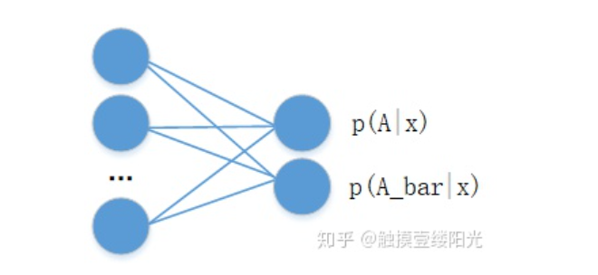

<h1 align="center">softmax</h1>


https://zhuanlan.zhihu.com/p/105722023


这里的最后的 `y = s (Wh2 +b)`中的`s`，即softmax函数，会将结果调整到（0,1），并且和为1，用于概率。

黄色的叫隐藏层，最后一层为输出层。该模型需要学习三组（w, b）。


将值映射到（0，1）范围，并且这些范围相加和为1。比如数字识别，最后使用softmax，得到各个概率。


提到二分类首先想到的可能就是逻辑回归算法。逻辑回归算法是在各个领域中应用比较广泛的机器学习算法。逻辑回归算法本身并不难，最关键的步骤就是将线性模型输出的实数域映射到[0, 1]表示概率分布的有效实数空间，其中Sigmoid函数刚好具有这样的功能。


sigmoid激活函数

例如使用逻辑回归算法预测患者是否有恶性肿瘤的二分类问题中，输出层可以只设置一个节点，表示某个事件A发生的概率为 P(A|x) ，其中x为输入。对于患者是否有恶性肿瘤的二分类问题中，A事件可以表示为恶性肿瘤或表示为良性肿瘤（ A¯ 表示为良性肿瘤或恶性肿瘤），x为患者的一些特征指标。


拥有单个输出节点的二分类

对于二分类问题，除了可以使用单个输出节点表示事件A发生的概率 P(A|x) 外，还可以分别预测 P(A|x) 和 P(A¯|x) ，并满足约束： P(A|x)+P(A¯|x)=1 。其中 A¯ 表示事件A的对立事件。




拥有两个输出节点的二分类

两个节点输出的二分类相比于单节点输出的二分类多了一个P(A|x)+P(A¯|x)=1的约束条件，这个约束条件将输出节点的输出值变成一个概率分布，简单来说各个输出节点的输出值范围映射到[0, 1]，并且约束各个输出节点的输出值的和为1。**当然可以将输出为两个节点的二分类推广成拥有n个输出节点的n分类问题。**

有没有将各个输出节点的输出值范围映射到[0, 1]，并且约束各个输出节点的输出值的和为1的函数呢？

当然，这个函数就是Softmax函数。

## 1. 什么是Softmax？

Softmax从字面上来说，可以分成soft和max两个部分。max故名思议就是最大值的意思。Softmax的核心在于soft，而soft有软的含义，与之相对的是hard硬。很多场景中需要我们找出数组所有元素中值最大的元素，实质上都是求的hardmax。下面使用Numpy模块以及TensorFlow深度学习框架实现hardmax。

使用Numpy模块实现hardmax：

```python
import numpy as np

a = np.array([1, 2, 3, 4, 5]) # 创建ndarray数组
a_max = np.max(a)
print(a_max) # 5
```

使用TensorFlow深度学习框架实现hardmax：

```python
import tensorflow as tf

print(tf.__version__) # 2.0.0
a_max = tf.reduce_max([1, 2, 3, 4, 5])
print(a_max) # tf.Tensor(5, shape=(), dtype=int32)
```

通过上面的例子可以看出hardmax最大的特点就是只选出其中一个最大的值，即非黑即白。但是往往在实际中这种方式是不合情理的，比如对于文本分类来说，一篇文章或多或少包含着各种主题信息，我们更期望得到文章对于每个可能的文本类别的概率值（置信度），可以简单理解成属于对应类别的可信度。所以此时用到了soft的概念，Softmax的含义就在于不再唯一的确定某一个最大值，而是为每个输出分类的结果都赋予一个概率值，表示属于每个类别的可能性。

下面给出Softmax函数的定义（以第i个节点输出为例）：

Softmax(zi)=ezi∑c=1Cezc ，其中 zi 为第i个节点的输出值，C为输出节点的个数，即分类的类别个数。通过Softmax函数就可以将多分类的输出值转换为范围在[0, 1]和为1的概率分布。