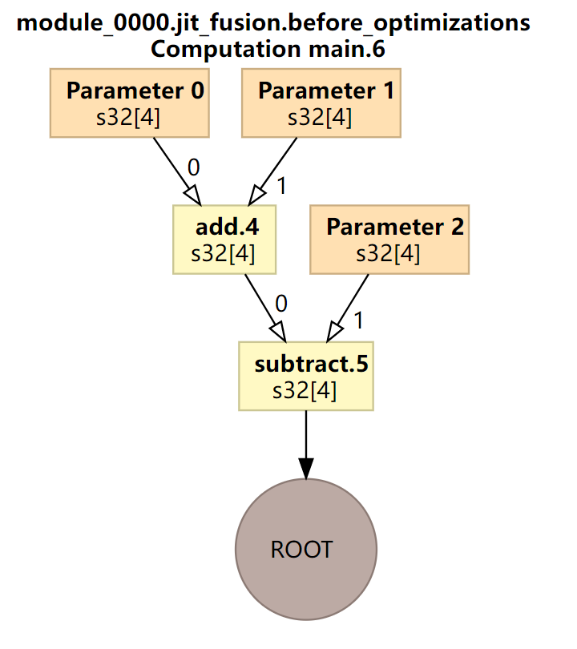
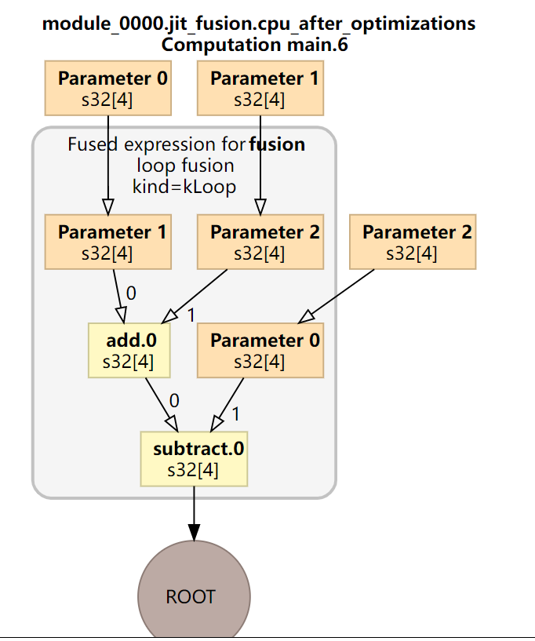

## JIT编译条件

hat said, `jax.jit` does have limitations: in particular, it requires all arrays to have static shapes. That means that some JAX operations are incompatible with JIT compilation.

For example, this operation can be executed in op-by-op mode:

```python
def get_negatives(x):
  return x[x < 0]

x = jnp.array(np.random.randn(10))
get_negatives(x)
```


```python
DeviceArray([-0.10570311, -0.59403396, -0.8680282 , -0.23489487], dtype=float32)
```


But it returns an error if you attempt to execute it in jit mode:

```python
jit(get_negatives)(x)
```


```python
---------------------------------------------------------------------------
IndexError                                Traceback (most recent call last)
<ipython-input-19-ec8799cf80d7> in <module>()
----> 1 jit(get_negatives)(x)

IndexError: Array boolean indices must be concrete.
```

JIX JIT编译需要有静态的shape


## case

`192.168.53.138:/home/ken/workspace/test/jax/test1`

需要设置`export JAX_DUMP_IR_TO=ir`,并事先建立好`ir`文件夹。

实现函数fusion，输入三个参数a,b,c可以实现a+b-c，并对fusion进行即时编译（代码中+-均被JAX处理为原语，因此可以即时编译）：


### 非jit编译

```python
import jax
import jax.numpy as jnp
import os
##################################################
jax.config.update("jax_platform_name", 'cpu')
current_platform = jax.default_backend()
print(f'当前平台为{current_platform}')
os.environ['JAX_DUMP_IR_TO'] = 'ir'
##################################################

a = jnp.array([1,2,3,4])
b = jnp.array([1,3,4,4])
c = jnp.array([1,2,3,5])

def fusion(a,b,c):
    return a+b-c

fusion(a,b,c)

```


```python
(jaxEnv) ken@lynxi:~/workspace/test/jax/test1/no_jit$ tree
.
├── ir
│   ├── jax_ir0_jit_fn.mlir
│   └── jax_ir1_jit__lambda_.mlir
├── test.py
└── tmp
    └── foo
        ├── module_0000.jit_fn.before_optimizations.dot
        ├── module_0000.jit_fn.before_optimizations.hlo.pb
        ├── module_0000.jit_fn.before_optimizations.html
        ├── module_0000.jit_fn.before_optimizations.txt
        ├── module_0000.jit_fn.cpu_after_optimizations-buffer-assignment.txt
        ├── module_0000.jit_fn.cpu_after_optimizations.dot
        ├── module_0000.jit_fn.cpu_after_optimizations.hlo.pb
        ├── module_0000.jit_fn.cpu_after_optimizations.html
        ├── module_0000.jit_fn.cpu_after_optimizations.txt
        ├── module_0000.jit_fn.ir-no-opt.ll
        ├── module_0000.jit_fn.ir-no-opt-noconst.ll
        ├── module_0000.jit_fn.ir-with-opt.ll
        ├── module_0000.jit_fn.ir-with-opt-noconst.ll
        ├── module_0000.jit_fn.o
        ├── module_0001.jit__lambda_.before_optimizations.dot
        ├── module_0001.jit__lambda_.before_optimizations.hlo.pb
        ├── module_0001.jit__lambda_.before_optimizations.html
        ├── module_0001.jit__lambda_.before_optimizations.txt
        ├── module_0001.jit__lambda_.cpu_after_optimizations-buffer-assignment.txt
        ├── module_0001.jit__lambda_.cpu_after_optimizations.dot
        ├── module_0001.jit__lambda_.cpu_after_optimizations.hlo.pb
        ├── module_0001.jit__lambda_.cpu_after_optimizations.html
        ├── module_0001.jit__lambda_.cpu_after_optimizations.txt
        ├── module_0001.jit__lambda_.ir-no-opt.ll
        ├── module_0001.jit__lambda_.ir-no-opt-noconst.ll
        ├── module_0001.jit__lambda_.ir-with-opt.ll
        ├── module_0001.jit__lambda_.ir-with-opt-noconst.ll
        └── module_0001.jit__lambda_.o

```


得到两个ir文件：

```python
cat ir/jax_ir0_jit_fn.mlir
#loc0 = loc(unknown)
module @jit_fn {
  func.func public @main(%arg0: tensor<4xi32> loc(unknown), %arg1: tensor<4xi32> loc(unknown)) -> tensor<4xi32> {
    %0 = mhlo.add %arg0, %arg1 : tensor<4xi32> loc(#loc1)
    return %0 : tensor<4xi32> loc(#loc0)
  } loc(#loc0)
} loc(#loc0)
#loc1 = loc("jit(fn)/jit(main)/add"("./test.py":17:1))


cat ir/jax_ir1_jit__lambda_.mlir
#loc0 = loc(unknown)
module @jit__lambda_ {
  func.func public @main(%arg0: tensor<4xi32> loc(unknown), %arg1: tensor<4xi32> loc(unknown)) -> tensor<4xi32> {
    %0 = mhlo.subtract %arg0, %arg1 : tensor<4xi32> loc(#loc1)
    return %0 : tensor<4xi32> loc(#loc0)
  } loc(#loc0)
} loc(#loc0)
#loc1 = loc("jit(<lambda>)/jit(main)/sub"("./test.py":17:1))
```


优化前后图是相同的


### 使用jit编译

`/home/ken/workspace/test/jax/test1/jit`

```python
import jax
import jax.numpy as jnp
import os
##################################################
jax.config.update("jax_platform_name", 'cpu')
current_platform = jax.default_backend()
print(f'当前平台为{current_platform}')
os.environ['JAX_DUMP_IR_TO'] = 'ir_jit'
##################################################

a = jnp.array([1,2,3,4])
b = jnp.array([1,3,4,4])
c = jnp.array([1,2,3,5])

def fusion(a,b,c):
    return a+b-c

jit_fusion = jax.jit(fusion)
jit_fusion(a,b,c)

```


```python
.
├── ir
│   └── jax_ir0_jit_fusion.mlir
├── test.py
└── tmp
    └── foo
        ├── module_0000.jit_fusion.before_optimizations.dot
        ├── module_0000.jit_fusion.before_optimizations.hlo.pb
        ├── module_0000.jit_fusion.before_optimizations.html
        ├── module_0000.jit_fusion.before_optimizations.txt
        ├── module_0000.jit_fusion.cpu_after_optimizations-buffer-assignment.txt
        ├── module_0000.jit_fusion.cpu_after_optimizations.dot
        ├── module_0000.jit_fusion.cpu_after_optimizations.hlo.pb
        ├── module_0000.jit_fusion.cpu_after_optimizations.html
        ├── module_0000.jit_fusion.cpu_after_optimizations.txt
        ├── module_0000.jit_fusion.ir-no-opt.ll
        ├── module_0000.jit_fusion.ir-no-opt-noconst.ll
        ├── module_0000.jit_fusion.ir-with-opt.ll
        ├── module_0000.jit_fusion.ir-with-opt-noconst.ll
        └── module_0000.jit_fusion.o

```


只得到一个JIT文件`ir_jit/jax_ir0_jit_fusion.mlir`

```python

#loc0 = loc(unknown)
module @jit_fusion {
  func.func public @main(%arg0: tensor<4xi32> loc(unknown), %arg1: tensor<4xi32> loc(unknown), %arg2: tensor<4xi32> loc(unknown)) -> tensor<4xi32> {
    %0 = mhlo.add %arg0, %arg1 : tensor<4xi32> loc(#loc1)
    %1 = mhlo.subtract %0, %arg2 : tensor<4xi32> loc(#loc2)
    return %1 : tensor<4xi32> loc(#loc0)
  } loc(#loc0)
} loc(#loc0)
#loc1 = loc("jit(fusion)/jit(main)/add"("./test.py":28:1))
#loc2 = loc("jit(fusion)/jit(main)/sub"("./test.py":28:1))

```


`before_opt.png`




`after_opt.png`




对于非JIT编译，算子“+”先作为一个原语被发送给XLA，生成了代表a+b的很小的计算子图，然后“-”作为另一个原语被发送给XLA，a+b的结果与c生成了另一个小的计算子图。

如果对fusion即时编译，则会生成1个较大的计算图。