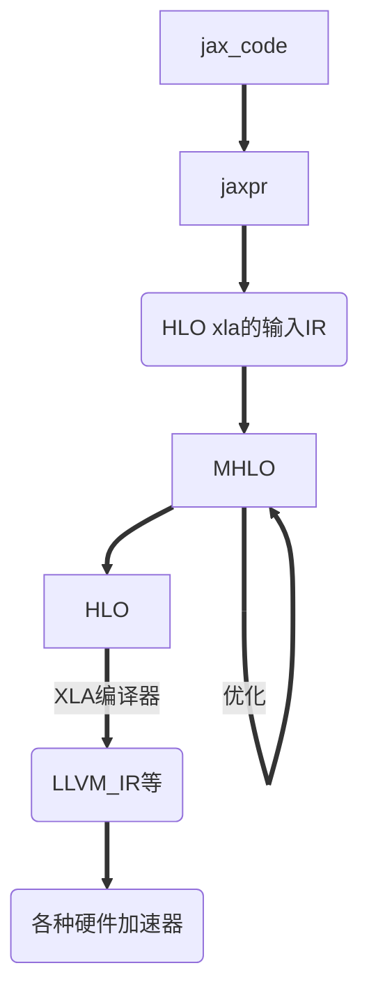

根据Tensorflow官网对XLA的介绍，XLA会对HLO进行算子融合等设备无关的图优化操作，但在JAX中还引入了基于MLIR的HLO（主要是MHLO）。

在JAX中对HLO实现算子融合等优化是由XLA实现的还是通过HLO转换为MHLO然后在MLIR系统中实现的，尚未完全搞清。总之XLA后端会一次性地接收到优化后的包含着fun1计算图信息的HLO，XLA后端结合目标硬件的属性对HLO计算图进一步进行优化，例如将某些操作或其组合进行模式匹配从而优化计算库调用。

最后，XLA后端将HLO IR转化为更底层的IR（如LLVM IR），LLVM再进行低级优化并生成机器码。

函数即时编译后生成的机器码会被缓存，当该函数的输入参数的形状、类型未发生改变，会复用已经缓存的机器码，显著加快运行速度。当函数输入参数形状或类型发生改变，会对该函数重新编译。

因此，运行一个完整的JAX程序时，如果代码中有多个函数，分别进行了即时编译，运行时，即时编译后的多个函数可以视作多个小的静态图，而整体上，一个JAX程序完整的计算图还是动态图的机制，比如多个静态图视作一个算子，动态地构建完整计算图。比如，多个小静态图之间有一些零散的JAX原语，这些原语还是一个一个地发送给XLA的。