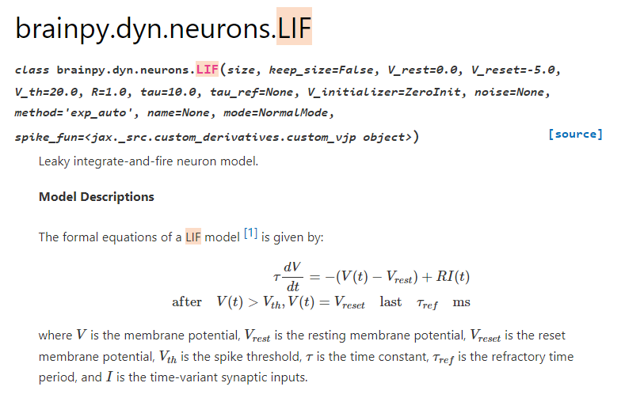
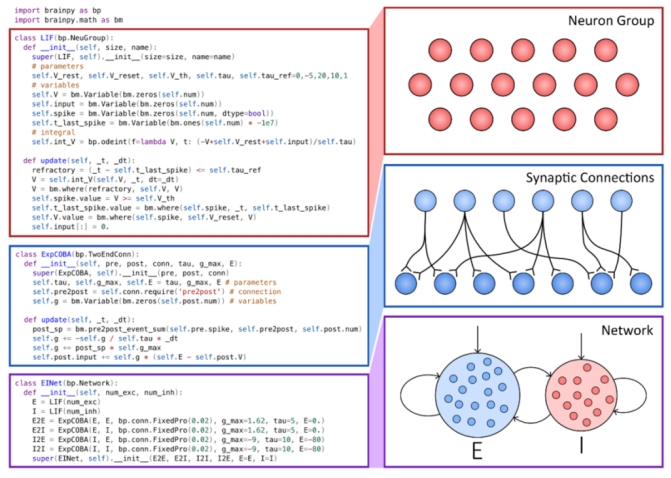
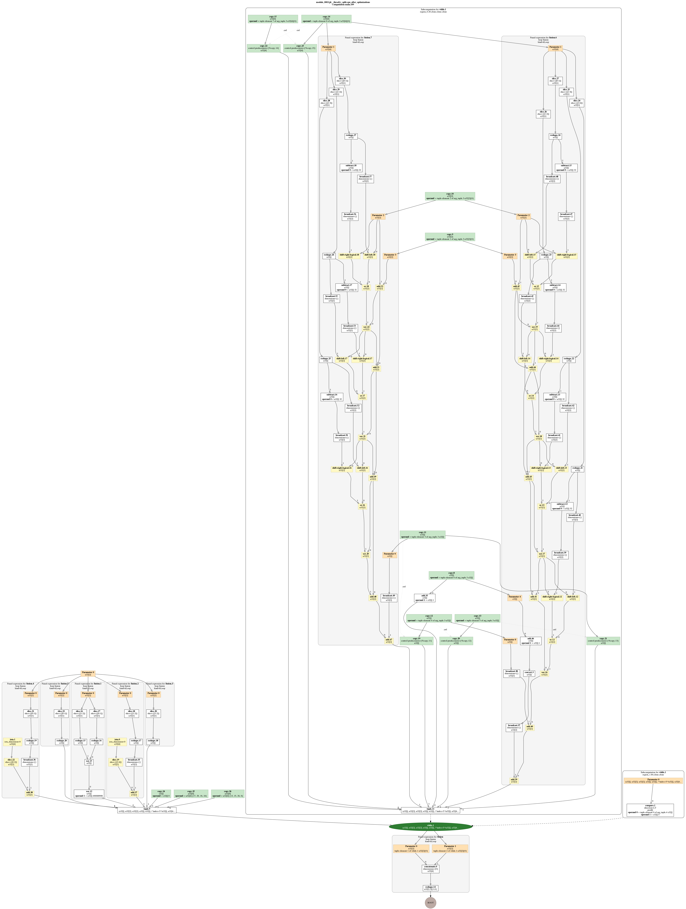

如果想要得到该例子的`hlo/mhlo`，可以修改`/home/ken/virtualEnv/jaxEnv/lib/python3.7/site-packages/brainpy/dyn/runners.py`，在其中加入如下输出代码：（422 ~ 428）为修改后新加入的代码。

```python
418     # running
419     if eval_time: t0 = time.time()
420     outputs, hists = self._predict(xs=(times, indices, xs), shared_args=shared_args)
421
422     ################################################
423     hlo_string = jax.jit(self._predict).lower(xs=(times, indices, xs)).as_text(dialect='hlo') # `mhlo`则输出mhlo
424     with open('/home/ken/log/hlo_string.txt','w') as f:
425       f.write(str(hlo_string))
426       f.close()
427
428     ################################################
429
430     if eval_time: running_time = time.time() - t0


```


`192.168.53.138:/home/ken/workspace/test/brainpy/case2`

```python
import brainpy as bp

bp.math.set_platform('cpu')

class EINet(bp.dyn.Network):
  def __init__(self, scale=1.0, method='exp_auto'):
    # network size
    num_exc = int(10000 * scale)
    num_inh = int(10000 * scale)

    # neurons
    pars = dict(V_rest=-60., V_th=-50., V_reset=-60., tau=20., tau_ref=5.)
    E = bp.dyn.LIF(num_exc, **pars, method=method)
    I = bp.dyn.LIF(num_inh, **pars, method=method)
    E.V[:] = bp.math.random.randn(num_exc) * 2 - 55.     # 10000 float32
    I.V[:] = bp.math.random.randn(num_inh) * 2 - 55.

    # synapses（突触）
    we = 0.6 / scale  # excitatory(兴奋) synaptic weight (voltage)
    wi = 6.7 / scale  # inhibitory(抑制) synaptic weight
    E2E = bp.dyn.ExpCOBA(E, E, bp.conn.FixedProb(0.02),
                         E=0., g_max=we, tau=5., method=method)
    E2I = bp.dyn.ExpCOBA(E, I, bp.conn.FixedProb(0.02),
                         E=0., g_max=we, tau=5., method=method)
    I2E = bp.dyn.ExpCOBA(I, E, bp.conn.FixedProb(0.02),
                         E=-80., g_max=wi, tau=10., method=method)
    I2I = bp.dyn.ExpCOBA(I, I, bp.conn.FixedProb(0.02),
                         E=-80., g_max=wi, tau=10., method=method)

    super(EINet, self).__init__(E2E, E2I, I2E, I2I, E=E, I=I)

net = EINet(scale=1., method='exp_auto')
# simulation
runner = bp.dyn.DSRunner(net,
                         monitors=['E.spike'],
                         inputs=[('E.input', 20.), ('I.input', 20.)],
                         jit=True)
t = runner.run(1000.)
#t = runner.run(1000.)
#print(t)
```

`brainpy.dyn.neurons.LIF` doc https://brainpy.readthedocs.io/en/latest/apis/auto/dyn/generated/brainpy.dyn.neurons.LIF.html?highlight=LIF




V是膜电位

Vth是spke threshold电位，

Vrest是静息电位

Vreset是reset膜电位，到达spike threshold后进行重置的值，

tao是时间常量

Tref：不应期时间，为了使模型更精准


上述代码中LIF表示脑仿真领域中的1种经典的神经元模型，LIF的参数num_exc等表示LIF神经元的个数，bp.dyn.LIF（num_exc,……）表示num_exc个LIF神经元组成的神经元簇，ExpCOBA表示用于连接不同神经元的突触模型，EINet表示由一个兴奋性（E）神经元簇和一个抑制性（I）神经元簇通过突触连接而成的一个简单脑仿真网络。建模过程的说明图片如下所示：

`class LIF`定义在下面这个文件中。

`/home/ken/virtualEnv/jaxEnv/lib/python3.7/site-packages/brainpy/dyn/neurons/reduced_models.py`

 

上述代码中构建runner时jit参数设置为True，进行即时编译。设置环境变量JAX_DUMP_IR_TO为某个文件路径，然后运行上述模型。生成的IR文件会储存到环境变量对应的路径中。


```python
├── ir
│   ├── jax_ir0_jit_prim_fun.mlir
│   ├── jax_ir10_jit_prim_fun.mlir
│   ├── jax_ir11_jit_prim_fun.mlir
│   ├── jax_ir12_jit_fn.mlir
│   ├── jax_ir13_jit_fn.mlir
│   ├── jax_ir14_jit_prim_fun.mlir
│   ├── jax_ir15_jit__lambda_.mlir
│   ├── jax_ir1_jit_prim_fun.mlir
│   ├── jax_ir2_jit_fn.mlir
│   ├── jax_ir3_jit__threefry_split.mlir
│   ├── jax_ir4_jit_prim_fun.mlir
│   ├── jax_ir5_jit_prim_fun.mlir
│   ├── jax_ir6_jit_prim_fun.mlir
│   ├── jax_ir7_jit__normal.mlir
│   ├── jax_ir8_jit_fn.mlir
│   └── jax_ir9_jit__lambda_.mlir
├── test.py
└── tmp
    └── foo
        ├── module_0000.jit_prim_fun.before_optimizations.dot
        ├── module_0000.jit_prim_fun.before_optimizations.hlo.pb
        ├── module_0000.jit_prim_fun.before_optimizations.html
        ├── module_0000.jit_prim_fun.before_optimizations.txt
        ├── module_0000.jit_prim_fun.cpu_after_optimizations-buffer-assignment.txt
        ├── module_0000.jit_prim_fun.cpu_after_optimizations.dot
        ├── module_0000.jit_prim_fun.cpu_after_optimizations.hlo.pb
        ├── module_0000.jit_prim_fun.cpu_after_optimizations.html
        ├── module_0000.jit_prim_fun.cpu_after_optimizations.txt
        ├── module_0000.jit_prim_fun.ir-no-opt.ll
        ├── module_0000.jit_prim_fun.ir-no-opt-noconst.ll
        ├── module_0000.jit_prim_fun.ir-with-opt.ll
        ├── module_0000.jit_prim_fun.ir-with-opt-noconst.ll
        ├── module_0000.jit_prim_fun.o
        ├── module_0001.jit_prim_fun.before_optimizations.dot
        ├── module_0001.jit_prim_fun.before_optimizations.hlo.pb
        ├── module_0001.jit_prim_fun.before_optimizations.html
        ├── module_0001.jit_prim_fun.before_optimizations.txt
        ├── module_0001.jit_prim_fun.cpu_after_optimizations-buffer-assignment.txt
        ├── module_0001.jit_prim_fun.cpu_after_optimizations.dot
        ├── module_0001.jit_prim_fun.cpu_after_optimizations.hlo.pb
        ├── module_0001.jit_prim_fun.cpu_after_optimizations.html
        ├── module_0001.jit_prim_fun.cpu_after_optimizations.txt
        ├── module_0001.jit_prim_fun.ir-no-opt.ll
        ├── module_0001.jit_prim_fun.ir-no-opt-noconst.ll
        ├── module_0001.jit_prim_fun.ir-with-opt.ll
        ├── module_0001.jit_prim_fun.ir-with-opt-noconst.ll
        ├── module_0001.jit_prim_fun.o
        ├── module_0002.jit_fn.before_optimizations.dot
        ├── module_0002.jit_fn.before_optimizations.hlo.pb
        ├── module_0002.jit_fn.before_optimizations.html
        ├── module_0002.jit_fn.before_optimizations.txt
        ├── module_0002.jit_fn.cpu_after_optimizations-buffer-assignment.txt
        ├── module_0002.jit_fn.cpu_after_optimizations.dot
        ├── module_0002.jit_fn.cpu_after_optimizations.hlo.pb
        ├── module_0002.jit_fn.cpu_after_optimizations.html
        ├── module_0002.jit_fn.cpu_after_optimizations.txt
        ├── module_0002.jit_fn.ir-no-opt.ll
        ├── module_0002.jit_fn.ir-no-opt-noconst.ll
        ├── module_0002.jit_fn.ir-with-opt.ll
        ├── module_0002.jit_fn.ir-with-opt-noconst.ll
        ├── module_0002.jit_fn.o
        ├── module_0003.jit__threefry_split.before_optimizations.dot
        ├── module_0003.jit__threefry_split.before_optimizations.hlo.pb
        ├── module_0003.jit__threefry_split.before_optimizations.html
        ├── module_0003.jit__threefry_split.before_optimizations.txt
        ├── module_0003.jit__threefry_split.cpu_after_optimizations-buffer-assignment.txt
        ├── module_0003.jit__threefry_split.cpu_after_optimizations.dot
        ├── module_0003.jit__threefry_split.cpu_after_optimizations.hlo.pb
        ├── module_0003.jit__threefry_split.cpu_after_optimizations.html
        ├── module_0003.jit__threefry_split.cpu_after_optimizations.txt
        ├── module_0003.jit__threefry_split.ir-no-opt.ll
        ├── module_0003.jit__threefry_split.ir-no-opt-noconst.ll
        ├── module_0003.jit__threefry_split.ir-with-opt.ll
        ├── module_0003.jit__threefry_split.ir-with-opt-noconst.ll
        ├── module_0003.jit__threefry_split.o
        ├── module_0004.jit_prim_fun.before_optimizations.dot
        ├── module_0004.jit_prim_fun.before_optimizations.hlo.pb
        ├── module_0004.jit_prim_fun.before_optimizations.html
        ├── module_0004.jit_prim_fun.before_optimizations.txt
        ├── module_0004.jit_prim_fun.cpu_after_optimizations-buffer-assignment.txt
        ├── module_0004.jit_prim_fun.cpu_after_optimizations.dot
        ├── module_0004.jit_prim_fun.cpu_after_optimizations.hlo.pb
        ├── module_0004.jit_prim_fun.cpu_after_optimizations.html
        ├── module_0004.jit_prim_fun.cpu_after_optimizations.txt
        ├── module_0004.jit_prim_fun.ir-no-opt.ll
        ├── module_0004.jit_prim_fun.ir-no-opt-noconst.ll
        ├── module_0004.jit_prim_fun.ir-with-opt.ll
        ├── module_0004.jit_prim_fun.ir-with-opt-noconst.ll
        ├── module_0004.jit_prim_fun.o
        ├── module_0005.jit_prim_fun.before_optimizations.dot
        ├── module_0005.jit_prim_fun.before_optimizations.hlo.pb
        ├── module_0005.jit_prim_fun.before_optimizations.html
        ├── module_0005.jit_prim_fun.before_optimizations.txt
        ├── module_0005.jit_prim_fun.cpu_after_optimizations-buffer-assignment.txt
        ├── module_0005.jit_prim_fun.cpu_after_optimizations.dot
        ├── module_0005.jit_prim_fun.cpu_after_optimizations.hlo.pb
        ├── module_0005.jit_prim_fun.cpu_after_optimizations.html
        ├── module_0005.jit_prim_fun.cpu_after_optimizations.txt
        ├── module_0005.jit_prim_fun.ir-no-opt.ll
        ├── module_0005.jit_prim_fun.ir-no-opt-noconst.ll
        ├── module_0005.jit_prim_fun.ir-with-opt.ll
        ├── module_0005.jit_prim_fun.ir-with-opt-noconst.ll
        ├── module_0005.jit_prim_fun.o
        ├── module_0006.jit_prim_fun.before_optimizations.dot
        ├── module_0006.jit_prim_fun.before_optimizations.hlo.pb
        ├── module_0006.jit_prim_fun.before_optimizations.html
        ├── module_0006.jit_prim_fun.before_optimizations.txt
        ├── module_0006.jit_prim_fun.cpu_after_optimizations-buffer-assignment.txt
        ├── module_0006.jit_prim_fun.cpu_after_optimizations.dot
        ├── module_0006.jit_prim_fun.cpu_after_optimizations.hlo.pb
        ├── module_0006.jit_prim_fun.cpu_after_optimizations.html
        ├── module_0006.jit_prim_fun.cpu_after_optimizations.txt
        ├── module_0006.jit_prim_fun.ir-no-opt.ll
        ├── module_0006.jit_prim_fun.ir-no-opt-noconst.ll
        ├── module_0006.jit_prim_fun.ir-with-opt.ll
        ├── module_0006.jit_prim_fun.ir-with-opt-noconst.ll
        ├── module_0006.jit_prim_fun.o
        ├── module_0008.jit__normal.before_optimizations.dot
        ├── module_0008.jit__normal.before_optimizations.hlo.pb
        ├── module_0008.jit__normal.before_optimizations.html
        ├── module_0008.jit__normal.before_optimizations.txt
        ├── module_0008.jit__normal.cpu_after_optimizations-buffer-assignment.txt
        ├── module_0008.jit__normal.cpu_after_optimizations.dot
        ├── module_0008.jit__normal.cpu_after_optimizations.hlo.pb
        ├── module_0008.jit__normal.cpu_after_optimizations.html
        ├── module_0008.jit__normal.cpu_after_optimizations.txt
        ├── module_0008.jit__normal.ir-no-opt.ll
        ├── module_0008.jit__normal.ir-no-opt-noconst.ll
        ├── module_0008.jit__normal.ir-with-opt.ll
        ├── module_0008.jit__normal.ir-with-opt-noconst.ll
        ├── module_0008.jit__normal.o
        ├── module_0009.jit_fn.before_optimizations.dot
        ├── module_0009.jit_fn.before_optimizations.hlo.pb
        ├── module_0009.jit_fn.before_optimizations.html
        ├── module_0009.jit_fn.before_optimizations.txt
        ├── module_0009.jit_fn.cpu_after_optimizations-buffer-assignment.txt
        ├── module_0009.jit_fn.cpu_after_optimizations.dot
        ├── module_0009.jit_fn.cpu_after_optimizations.hlo.pb
        ├── module_0009.jit_fn.cpu_after_optimizations.html
        ├── module_0009.jit_fn.cpu_after_optimizations.txt
        ├── module_0009.jit_fn.ir-no-opt.ll
        ├── module_0009.jit_fn.ir-no-opt-noconst.ll
        ├── module_0009.jit_fn.ir-with-opt.ll
        ├── module_0009.jit_fn.ir-with-opt-noconst.ll
        ├── module_0009.jit_fn.o
        ├── module_0010.jit__lambda_.before_optimizations.dot
        ├── module_0010.jit__lambda_.before_optimizations.hlo.pb
        ├── module_0010.jit__lambda_.before_optimizations.html
        ├── module_0010.jit__lambda_.before_optimizations.txt
        ├── module_0010.jit__lambda_.cpu_after_optimizations-buffer-assignment.txt
        ├── module_0010.jit__lambda_.cpu_after_optimizations.dot
        ├── module_0010.jit__lambda_.cpu_after_optimizations.hlo.pb
        ├── module_0010.jit__lambda_.cpu_after_optimizations.html
        ├── module_0010.jit__lambda_.cpu_after_optimizations.txt
        ├── module_0010.jit__lambda_.ir-no-opt.ll
        ├── module_0010.jit__lambda_.ir-no-opt-noconst.ll
        ├── module_0010.jit__lambda_.ir-with-opt.ll
        ├── module_0010.jit__lambda_.ir-with-opt-noconst.ll
        ├── module_0010.jit__lambda_.o
        ├── module_0011.jit_prim_fun.before_optimizations.dot
        ├── module_0011.jit_prim_fun.before_optimizations.hlo.pb
        ├── module_0011.jit_prim_fun.before_optimizations.html
        ├── module_0011.jit_prim_fun.before_optimizations.txt
        ├── module_0011.jit_prim_fun.cpu_after_optimizations-buffer-assignment.txt
        ├── module_0011.jit_prim_fun.cpu_after_optimizations.dot
        ├── module_0011.jit_prim_fun.cpu_after_optimizations.hlo.pb
        ├── module_0011.jit_prim_fun.cpu_after_optimizations.html
        ├── module_0011.jit_prim_fun.cpu_after_optimizations.txt
        ├── module_0011.jit_prim_fun.ir-no-opt.ll
        ├── module_0011.jit_prim_fun.ir-no-opt-noconst.ll
        ├── module_0011.jit_prim_fun.ir-with-opt.ll
        ├── module_0011.jit_prim_fun.ir-with-opt-noconst.ll
        ├── module_0011.jit_prim_fun.o
        ├── module_0012.jit_prim_fun.before_optimizations.dot
        ├── module_0012.jit_prim_fun.before_optimizations.hlo.pb
        ├── module_0012.jit_prim_fun.before_optimizations.html
        ├── module_0012.jit_prim_fun.before_optimizations.txt
        ├── module_0012.jit_prim_fun.cpu_after_optimizations-buffer-assignment.txt
        ├── module_0012.jit_prim_fun.cpu_after_optimizations.dot
        ├── module_0012.jit_prim_fun.cpu_after_optimizations.hlo.pb
        ├── module_0012.jit_prim_fun.cpu_after_optimizations.html
        ├── module_0012.jit_prim_fun.cpu_after_optimizations.txt
        ├── module_0012.jit_prim_fun.ir-no-opt.ll
        ├── module_0012.jit_prim_fun.ir-no-opt-noconst.ll
        ├── module_0012.jit_prim_fun.ir-with-opt.ll
        ├── module_0012.jit_prim_fun.ir-with-opt-noconst.ll
        ├── module_0012.jit_prim_fun.o
        ├── module_0013.jit_fn.before_optimizations.dot
        ├── module_0013.jit_fn.before_optimizations.hlo.pb
        ├── module_0013.jit_fn.before_optimizations.html
        ├── module_0013.jit_fn.before_optimizations.txt
        ├── module_0013.jit_fn.cpu_after_optimizations-buffer-assignment.txt
        ├── module_0013.jit_fn.cpu_after_optimizations.dot
        ├── module_0013.jit_fn.cpu_after_optimizations.hlo.pb
        ├── module_0013.jit_fn.cpu_after_optimizations.html
        ├── module_0013.jit_fn.cpu_after_optimizations.txt
        ├── module_0013.jit_fn.ir-no-opt.ll
        ├── module_0013.jit_fn.ir-no-opt-noconst.ll
        ├── module_0013.jit_fn.ir-with-opt.ll
        ├── module_0013.jit_fn.ir-with-opt-noconst.ll
        ├── module_0013.jit_fn.o
        ├── module_0014.jit_fn.before_optimizations.dot
        ├── module_0014.jit_fn.before_optimizations.hlo.pb
        ├── module_0014.jit_fn.before_optimizations.html
        ├── module_0014.jit_fn.before_optimizations.txt
        ├── module_0014.jit_fn.cpu_after_optimizations-buffer-assignment.txt
        ├── module_0014.jit_fn.cpu_after_optimizations.dot
        ├── module_0014.jit_fn.cpu_after_optimizations.hlo.pb
        ├── module_0014.jit_fn.cpu_after_optimizations.html
        ├── module_0014.jit_fn.cpu_after_optimizations.txt
        ├── module_0014.jit_fn.ir-no-opt.ll
        ├── module_0014.jit_fn.ir-no-opt-noconst.ll
        ├── module_0014.jit_fn.ir-with-opt.ll
        ├── module_0014.jit_fn.ir-with-opt-noconst.ll
        ├── module_0014.jit_fn.o
        ├── module_0019.jit_prim_fun.before_optimizations.dot
        ├── module_0019.jit_prim_fun.before_optimizations.hlo.pb
        ├── module_0019.jit_prim_fun.before_optimizations.html
        ├── module_0019.jit_prim_fun.before_optimizations.txt
        ├── module_0019.jit_prim_fun.cpu_after_optimizations-buffer-assignment.txt
        ├── module_0019.jit_prim_fun.cpu_after_optimizations.dot
        ├── module_0019.jit_prim_fun.cpu_after_optimizations.hlo.pb
        ├── module_0019.jit_prim_fun.cpu_after_optimizations.html
        ├── module_0019.jit_prim_fun.cpu_after_optimizations.txt
        ├── module_0019.jit_prim_fun.ir-no-opt.ll
        ├── module_0019.jit_prim_fun.ir-no-opt-noconst.ll
        ├── module_0019.jit_prim_fun.ir-with-opt.ll
        ├── module_0019.jit_prim_fun.ir-with-opt-noconst.ll
        ├── module_0019.jit_prim_fun.o
        ├── module_0025.jit__lambda_.before_optimizations.dot
        ├── module_0025.jit__lambda_.before_optimizations.hlo.pb
        ├── module_0025.jit__lambda_.before_optimizations.html
        ├── module_0025.jit__lambda_.before_optimizations.txt
        ├── module_0025.jit__lambda_.cpu_after_optimizations-buffer-assignment.txt
        ├── module_0025.jit__lambda_.cpu_after_optimizations.dot
        ├── module_0025.jit__lambda_.cpu_after_optimizations.hlo.pb
        ├── module_0025.jit__lambda_.cpu_after_optimizations.html
        ├── module_0025.jit__lambda_.cpu_after_optimizations.txt
        ├── module_0025.jit__lambda_.ir-no-opt.ll
        ├── module_0025.jit__lambda_.ir-no-opt-noconst.ll
        ├── module_0025.jit__lambda_.ir-with-opt.ll
        ├── module_0025.jit__lambda_.ir-with-opt-noconst.ll
        └── module_0025.jit__lambda_.o

3 directories, 241 files
```


https://neuronaldynamics.epfl.ch/online/Ch13.S6.html

https://uci-carl.github.io/CARLsim3/ch3_neurons_synapses_groups.html#ch3s2_synapses

```
基于电流 (CUBA) 的描述使用单个突触电流项，而基于电导 (COBA) 的描述使用更复杂的电导方程为每个突触受体类型计算突触电流。 CUBA 和 COBA 电流贡献都受到突触的突触权重的影响。

因为 CUBA 模式的突触电流会持续一个时间步长，而 COBA 模式的突触电流会随着时间衰减，所以从 CUBA 模式切换到 COBA 模式通常需要用户减少突触权重，因为在COBA 模式。
```


以下两个图是`tmp/foo`下最大的两个dot文件转换得到的图。

`module_0003.jit__threefry_split.cpu_after_optimizations.dot`





`module_0008.jit__normal.cpu_after_optimizations.dot`


