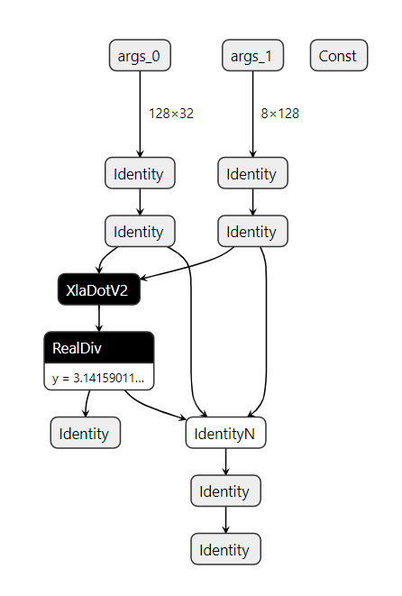

### 导出tensorflow能识别的pb文件

```python
// An example for reading a HloModule from a HloProto file and execute the
// module on PJRT CPU client.
//
// To build a HloModule,
//
// $ python3 jax/tools/jax_to_hlo.py \
// --fn examples.jax_cpp.prog.fn \
// --input_shapes '[("x", "f32[2,2]"), ("y", "f32[2,2]")]' \
// --constants '{"z": 2.0}' \
// --hlo_text_dest /tmp/fn_hlo.txt \
// --hlo_proto_dest /tmp/fn_hlo.pb
//
// To load and run the HloModule,
//
// $ bazel build examples/jax_cpp:main --experimental_repo_remote_exec --check_visibility=false
// $ bazel-bin/examples/jax_cpp/main
// 2021-01-12 15:35:28.316880: I examples/jax_cpp/main.cc:65] result = (
// f32[2,2] {
//   { 1.5, 1.5 },
//   { 3.5, 3.5 }
// }
// )
```


修改`jax_to_ir.py`

```python
193
194   ir, debug_ir = jax_to_tf(fn, input_shapes, constants=constants,
195                            format='TF')

```


```python

$ cat prog.py
  import jax.numpy as jnp

  def fn(x, y, z):
    return jnp.dot(x, y) / z

  $ python jax_to_ir.py \
    --fn prog.fn \
    --input_shapes '[("y", "f32[128,32]"), ("x", "f32[8,128]")]' \
    --constants '{"z": 3.14159}' \
    --ir_format HLO \
    --ir_human_dest tf_tmp/fn_hlo.txt \
    --ir_dest tf_tmp/fn_hlo.pb
```


```python
(tf2.1) ken@lynxi:~/workspace/test/jax/pb_jax_to_tf$ tree
.
├── ir
│   ├── jax_ir0_jit_prim_fun.mlir
│   └── jax_ir1_jit_prim_fun.mlir
├── jax_to_ir.py
├── prog.py
├── __pycache__
│   └── prog.cpython-37.pyc
├── tf_tmp
│   ├── fn_hlo.pb
│   └── fn_hlo.txt
└── tmp
    ├── foo
    │   ├── module_0000.jit_prim_fun.before_optimizations.dot
    │   ├── module_0000.jit_prim_fun.before_optimizations.hlo.pb
    │   ├── module_0000.jit_prim_fun.before_optimizations.html
    │   ├── module_0000.jit_prim_fun.before_optimizations.txt
    │   ├── module_0000.jit_prim_fun.cpu_after_optimizations-buffer-assignment.txt
    │   ├── module_0000.jit_prim_fun.cpu_after_optimizations.dot
    │   ├── module_0000.jit_prim_fun.cpu_after_optimizations.hlo.pb
    │   ├── module_0000.jit_prim_fun.cpu_after_optimizations.html
    │   ├── module_0000.jit_prim_fun.cpu_after_optimizations.top_level.html
    │   ├── module_0000.jit_prim_fun.cpu_after_optimizations.txt
    │   ├── module_0000.jit_prim_fun.ir-no-opt.ll
    │   ├── module_0000.jit_prim_fun.ir-no-opt-noconst.ll
    │   ├── module_0000.jit_prim_fun.ir-with-opt.ll
    │   ├── module_0000.jit_prim_fun.ir-with-opt-noconst.ll
    │   ├── module_0000.jit_prim_fun.o
    │   ├── module_0001.jit_prim_fun.before_optimizations.dot
    │   ├── module_0001.jit_prim_fun.before_optimizations.hlo.pb
    │   ├── module_0001.jit_prim_fun.before_optimizations.html
    │   ├── module_0001.jit_prim_fun.before_optimizations.txt
    │   ├── module_0001.jit_prim_fun.cpu_after_optimizations-buffer-assignment.txt
    │   ├── module_0001.jit_prim_fun.cpu_after_optimizations.dot
    │   ├── module_0001.jit_prim_fun.cpu_after_optimizations.hlo.pb
    │   ├── module_0001.jit_prim_fun.cpu_after_optimizations.html
    │   ├── module_0001.jit_prim_fun.cpu_after_optimizations.top_level.html
    │   ├── module_0001.jit_prim_fun.cpu_after_optimizations.txt
    │   ├── module_0001.jit_prim_fun.ir-no-opt.ll
    │   ├── module_0001.jit_prim_fun.ir-no-opt-noconst.ll
    │   ├── module_0001.jit_prim_fun.ir-with-opt.ll
    │   ├── module_0001.jit_prim_fun.ir-with-opt-noconst.ll
    │   └── module_0001.jit_prim_fun.o
    └── tf_dump_graph
        ├── before_increase_dynamism_for_auto_jit_pass.pbtxt
        ├── before_mark_for_compilation.pbtxt
        ├── mark_for_compilation_annotated.pbtxt
        └── mark_for_compilation.pbtxt

6 directories, 41 files

```


以下是`fn_hlo.pb`的内容




## 读取jax导出的pb文件

使用v1方法读入pb文件

`/home/ken/workspace/test/jax/pb_test`

```python
import tensorflow as tf

with tf.io.gfile.GFile("./tf_tmp/fn_hlo.pb", "rb") as f:
    graph_def = tf.compat.v1.GraphDef()
    loaded = graph_def.ParseFromString(f.read())

    tf.import_graph_def(graph_def, name='')
    graph_nodes=[n for n in graph_def.node]
    names = []
    for t in graph_nodes:
        names.append(t.name)

    print(names)

```


```python
['args_0', 'args_1', 'y', 'x', 'jax2tf_arg_0', 'jax2tf_arg_1', 'jax2tf_ordered_wrapper_/jit_dot_/XlaDotV2', 'Const', 'Const_1', 'jax2tf_ordered_wrapper_/jit_true_divide_/truediv', 'Identity', 'IdentityN', 'jax2tf_out', 'Identity_1']

```


