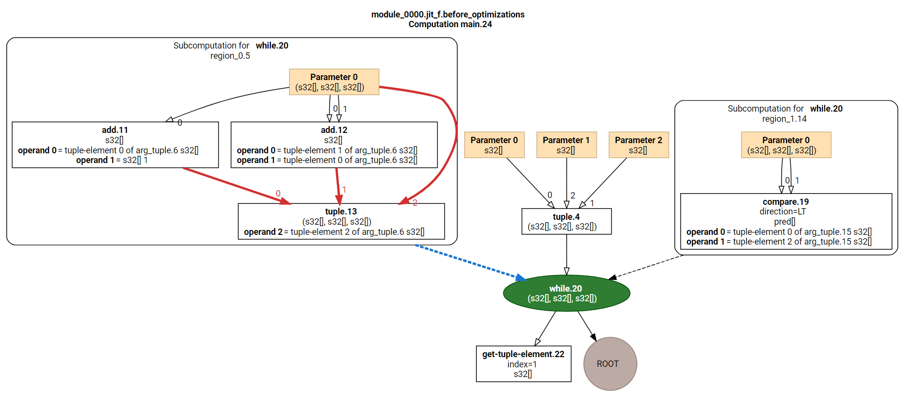
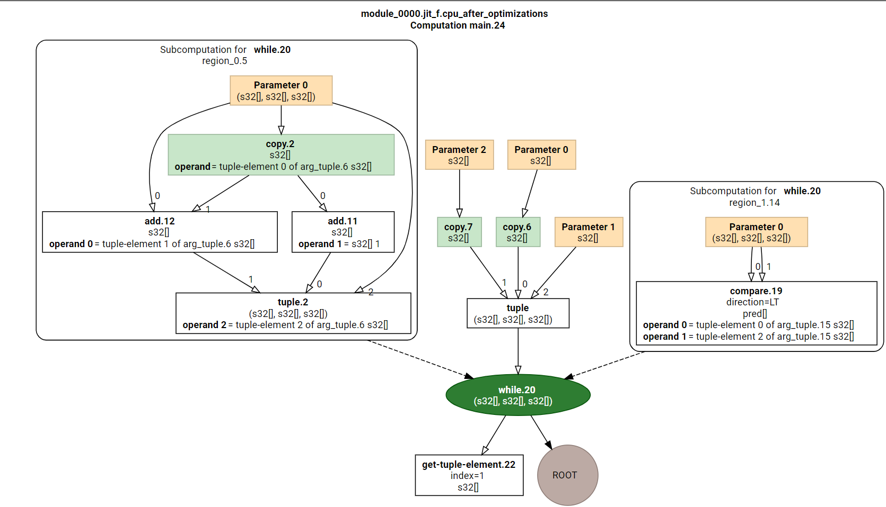
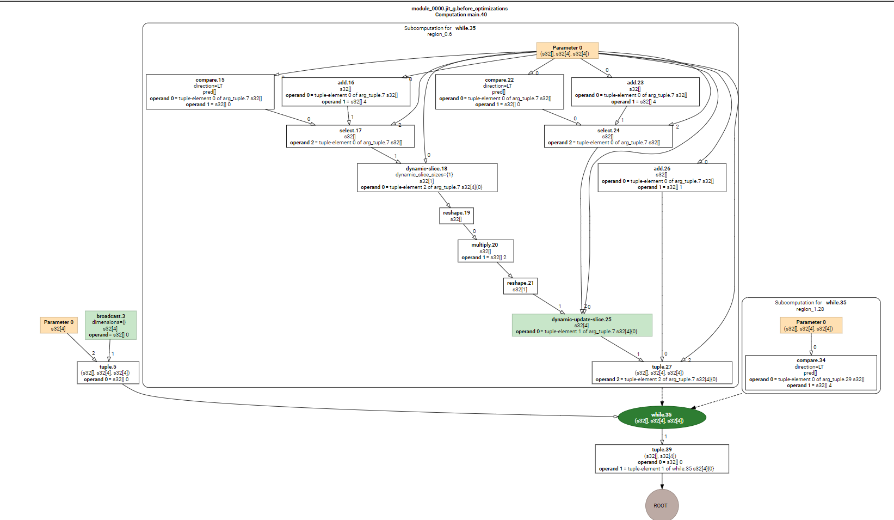
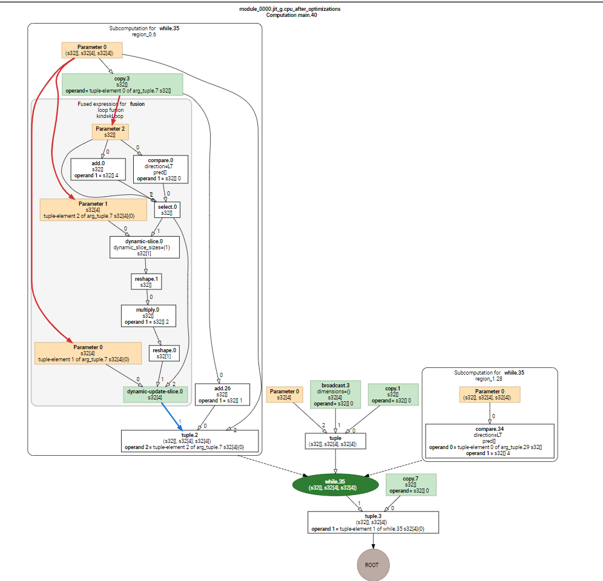
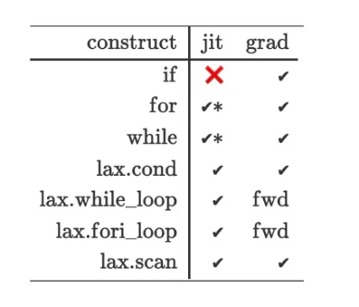

<h1 align="center">jax 如何处理loop</h1>


```asm
(jaxEnv) ken@lynxi:~/workspace/jax-jax-v0.3.17/jax/_src/lax/control_flow$ tree
.
├── common.py
├── conditionals.py
├── for_loop.py
├── __init__.py
├── loops.py
└── solves.py

```


## Control flow operators

| [`associative_scan`](https://jax.readthedocs.io/en/latest/_autosummary/jax.lax.associative_scan.html#jax.lax.associative_scan)(fn, elems[, reverse, axis]) | Performs a scan with an associative binary operation, in parallel. |
| ------------------------------------------------------------ | ------------------------------------------------------------ |
| [`cond`](https://jax.readthedocs.io/en/latest/_autosummary/jax.lax.cond.html#jax.lax.cond)(pred, true_fun, false_fun, *operands[, ...]) | Conditionally apply `true_fun` or `false_fun`.               |
| [`fori_loop`](https://jax.readthedocs.io/en/latest/_autosummary/jax.lax.fori_loop.html#jax.lax.fori_loop)(lower, upper, body_fun, init_val) | Loop from `lower` to `upper` by reduction to [`jax.lax.while_loop()`](https://jax.readthedocs.io/en/latest/_autosummary/jax.lax.while_loop.html#jax.lax.while_loop). |
| [`map`](https://jax.readthedocs.io/en/latest/_autosummary/jax.lax.map.html#jax.lax.map)(f, xs) | Map a function over leading array axes.                      |
| [`scan`](https://jax.readthedocs.io/en/latest/_autosummary/jax.lax.scan.html#jax.lax.scan)(f, init, xs[, length, reverse, unroll]) | Scan a function over leading array axes while carrying along state. |
| [`switch`](https://jax.readthedocs.io/en/latest/_autosummary/jax.lax.switch.html#jax.lax.switch)(index, branches, *operands[, operand]) | Apply exactly one of `branches` given by `index`.            |
| [`while_loop`](https://jax.readthedocs.io/en/latest/_autosummary/jax.lax.while_loop.html#jax.lax.while_loop)(cond_fun, body_fun, init_val) | Call `body_fun` repeatedly in a loop while `cond_fun` is True. |


## 1. JAX是怎么处理循环的？

在JAX中，python的循环控制是被完全展开的，因此当你的loop循环比较大的时候，XLA就要显式地编译每个循环的步骤。但实际从逻辑上，每次循环都应该只是一个重复的“小函数” f = x + i。

```python
import jax

def f(x):
    for i in range(5):
      x += i
    return x

jax.make_jaxpr(f)(0)

-----------------------------------
  out:
  { lambda ; a:i32[]. let
    b:i32[] = add a 0
    c:i32[] = add b 1
    d:i32[] = add c 2
    e:i32[] = add d 3
    f:i32[] = add e 4
  in (f,) }
```

为了减少jit的编译时间，一种解决办法是使用jax.vmap，把循环向量化操作。

另外一个解决办法就是用JAX内置的loop或条件性loop控制的API函数。

-----


## 2. Control Flow API

Control Flow的4种jax.lax的API：cond、while_loop、fori_loop、scan。以下我将每一个举生动的例子进行说明。

### 2.1 cond 判断分支控制

`~/workspace/test/jax/loop_cond/cond`

由于分支判断中涉及到了状态参数（True、False）。因此在jax.jit中编译必须将状态参数显式传递。

**python代码等价于：**

```python
def cond(pred, true_fun, false_fun, operand):
    if pred:
     	 return true_fun(operand)
    else:
     	 return false_fun(operand)
```

cond需要传递4个必须参数：

- pred：状态参数（True、False）
- true_fun：如果为True状态，执行的函数
- false_fun：如果为False状态，执行的函数
- operands：输入的变量。

举个使用例子：

```python
import jax
from jax import lax
import jax.numpy as jnp
def f(state, operand):
    return lax.cond(state, lambda x: x+1, lambda x: x-1, operand)


operand = jnp.array([0.])
print(jax.make_jaxpr(f)(True, operand))
print(jax.jit(f)(True, operand))

lowered = jax.jit(f).lower(True, operand)

# Print lowered MHLO
#print(lowered.as_text())  # eqaul to print(lowered.as_text("mhlo"))
print(lowered.as_text("hlo"))

```

使用lax.cond可以无痛使用jit！无需在注意将状态函数声明静态参数：

```python
# print(jax.make_jaxpr(f)(True, operand)) 输出结果
{ lambda ; a:bool[] b:f32[1]. let
    c:i32[] = convert_element_type[new_dtype=int32 weak_type=False] a
    d:f32[1] = cond[
      branches=(
        { lambda ; e:f32[1]. let f:f32[1] = sub e 1.0 in (f,) }
        { lambda ; g:f32[1]. let h:f32[1] = add g 1.0 in (h,) }
      )
      linear=(False,)
    ] c b
  in (d,) }

# print(jax.jit(f)(True, operand)) 输出结果
[1.]


# print(lowered.as_text("hlo"))输出
HloModule jit_f, entry_computation_layout={(pred[],f32[1]{0})->f32[1]{0}}

region_0.4 {
  Arg_.5 = f32[1]{0} parameter(0)
  constant.6 = f32[1]{0} constant({1})
  ROOT subtract.7 = f32[1]{0} subtract(Arg_.5, constant.6)
}

region_1.8 {
  Arg_.9 = f32[1]{0} parameter(0)
  constant.10 = f32[1]{0} constant({1})
  ROOT add.11 = f32[1]{0} add(Arg_.9, constant.10)
}

ENTRY main.13 {
  Arg_0.1 = pred[] parameter(0)
  convert.3 = s32[] convert(Arg_0.1)
  Arg_1.2 = f32[1]{0} parameter(1)
  ROOT conditional.12 = f32[1]{0} conditional(convert.3, Arg_1.2, Arg_1.2), branch_computations={region_0.4, region_1.8}   
}

```

从tracing的角度可见，state参数(a)是布尔型变量被traced，因此jit只要编译一次就够，反而如何使用静态参数声明，当变量状态变化时，jit就要重新编译一次了。因此cond大大减少了编译所需的次数和时间。


`lax.cond` ->  `hlo::conditional`  ->`mhlo.case`:

```python
~/workspace/test/jax/loop_cond/cond$ cat ir/jax_ir0_jit_f.mlir
#loc0 = loc(unknown)
module @jit_f {
  func.func public @main(%arg0: tensor<i1> loc(unknown), %arg1: tensor<1xf32> loc(unknown)) -> tensor<1xf32> {
    %0 = mhlo.convert(%arg0) : (tensor<i1>) -> tensor<i32> loc(#loc1)
    %1 = "mhlo.case"(%0) ({
      %2 = mhlo.constant dense<1.000000e+00> : tensor<f32> loc(#loc2)
      %3 = "mhlo.broadcast_in_dim"(%2) {broadcast_dimensions = dense<> : tensor<0xi64>} : (tensor<f32>) -> tensor<1xf32> loc(#loc3)
      %4 = mhlo.subtract %arg1, %3 : tensor<1xf32> loc(#loc3)
      mhlo.return %4 : tensor<1xf32> loc(#loc2)
    }, {
      %2 = mhlo.constant dense<1.000000e+00> : tensor<f32> loc(#loc2)
      %3 = "mhlo.broadcast_in_dim"(%2) {broadcast_dimensions = dense<> : tensor<0xi64>} : (tensor<f32>) -> tensor<1xf32> loc(#loc4)
      %4 = mhlo.add %arg1, %3 : tensor<1xf32> loc(#loc4)
      mhlo.return %4 : tensor<1xf32> loc(#loc2)
    }) : (tensor<i32>) -> tensor<1xf32> loc(#loc2)
    return %1 : tensor<1xf32> loc(#loc0)
  } loc(#loc0)
} loc(#loc0)

```


### 2.2 while_loop循环控制

while_loop顾名思义，循环直到满足某个x变量状态后停止循环，但缺点是，只能有一个init_val，循环的处理函数也只依赖于这个变量。

**python代码等价于：**

```python
def while_loop(cond_fun, body_fun, init_val):
    val = init_val
    while cond_fun(val):
      val = body_fun(val)
    return val
```

while_loop需要传递3个必须参数：

- cond_fun：判断终止的函数
- body_fun：执行函数
- init_val：变量初始值

举个简单的例子, **这里cond_fun由于jax在tracing的时候无法根据自身的输入变量进行分支控制，因此需要使用匿名函数处理。**

```python
init_val = 0
cond_fun = lambda x: x<10
body_fun = lambda x: x+1r
jax.lax.while_loop(cond_fun, body_fun, init_val)
-----------------------------------------------
  output: 
  DeviceArray(10, dtype=int32, weak_type=True)
```

与jit一起使用也是可以的：

```python
import jax
from jax import lax
import jax.numpy as jnp

init_val = 0

def f(init_val):
    cond_fun = lambda x: x<10
    body_fun = lambda x: x+1
    return jax.lax.while_loop(cond_fun, body_fun, init_val)

print(jax.make_jaxpr(f)(init_val))
print(jax.jit(f)(init_val))

lowered = jax.jit(f).lower(init_val)
print(lowered.as_text("hlo"))

```

看看内部处理机制：使用了while语句，并没有把循环显式地展开！

```python
# print(jax.make_jaxpr(f)(init_val)) 
{ lambda ; a:i32[]. let
    b:i32[] = while[
      body_jaxpr={ lambda ; c:i32[]. let d:i32[] = add c 1 in (d,) }
      body_nconsts=0
      cond_jaxpr={ lambda ; e:i32[]. let f:bool[] = lt e 10 in (f,) }
      cond_nconsts=0
    ] a
  in (b,) }

# print(jax.jit(f)(init_val))
10

# print(lowered.as_text("hlo"))
HloModule jit_f, entry_computation_layout={(s32[])->s32[]}

region_0.2 {
  Arg_.3 = s32[] parameter(0)
  constant.4 = s32[] constant(1)
  ROOT add.5 = s32[] add(Arg_.3, constant.4)
}

region_1.6 {
  Arg_.7 = s32[] parameter(0)
  constant.8 = s32[] constant(10)
  ROOT compare.9 = pred[] compare(Arg_.7, constant.8), direction=LT
}

ENTRY main.11 {
  Arg_0.1 = s32[] parameter(0)
  ROOT while.10 = s32[] while(Arg_0.1), condition=region_1.6, body=region_0.2
}
```


`jax.lax.while_loop` -> `hlo:while` -> `mhlo.while cond do`

```python
(jaxEnv) ken@lynxi:~/workspace/test/jax/while_loop$ cat ir/jax_ir0_jit_f.mlir
#loc0 = loc(unknown)
module @jit_f {
  func.func public @main(%arg0: tensor<i32> loc(unknown)) -> tensor<i32> {
    %0 = mhlo.while(%iterArg = %arg0) : tensor<i32>
     cond {
      %1 = mhlo.constant dense<10> : tensor<i32> loc(#loc1)
      %2 = mhlo.compare  LT, %iterArg, %1,  SIGNED : (tensor<i32>, tensor<i32>) -> tensor<i1> loc(#loc2)
      mhlo.return %2 : tensor<i1> loc(#loc1)
    } do {
      %1 = mhlo.constant dense<1> : tensor<i32> loc(#loc1)
      %2 = mhlo.add %iterArg, %1 : tensor<i32> loc(#loc3)
      mhlo.return %2 : tensor<i32> loc(#loc1)
    } loc(#loc1)
    return %0 : tensor<i32> loc(#loc0)
  } loc(#loc0)
} loc(#loc0)

```


### 2.3 fori_loop循环控制

`/home/ken/workspace/test/jax/fori_loop`

fori_loop就很类似于python的for i in range的写法了。

**python代码等价于：**

```python
def fori_loop(start, stop, body_fun, init_val):
    val = init_val
    for i in range(start, stop):
      	val = body_fun(i, val)
    return val
```

fori_loop需要传递4个必须参数：

- start：起始数值
- stop：停止数值
- body_fun：循环的函数
- init_val：输入的初始参数

```python
import jax
from jax import lax
import jax.numpy as jnp

start = 0
stop = 10
init_val = 0

def f(start, stop, init_val):
    body_fun = lambda i,x: x+i
    return jax.lax.fori_loop(start, stop, body_fun, init_val)


print(jax.make_jaxpr(f)(start, stop, init_val))
print(jax.jit(f)(start, stop, init_val))

lowered = jax.jit(f).lower(start, stop, init_val)
print(lowered.as_text("hlo"))
```

同样可以配合jit使用：

```python
# print(jax.make_jaxpr(f)(start, stop, init_val))
{ lambda ; a:i32[] b:i32[] c:i32[]. let
    _:i32[] _:i32[] d:i32[] = while[
      body_jaxpr={ lambda ; e:i32[] f:i32[] g:i32[]. let
          h:i32[] = add e 1
          i:i32[] = add g e
        in (h, f, i) }
      body_nconsts=0
      cond_jaxpr={ lambda ; j:i32[] k:i32[] l:i32[]. let
          m:bool[] = lt j k
        in (m,) }
      cond_nconsts=0
    ] a b c
  in (d,) }
# print(jax.jit(f)(start, stop, init_val))

45
HloModule jit_f, entry_computation_layout={(s32[],s32[],s32[])->s32[]}

# print(lowered.as_text("hlo"))
region_0.5 {
  arg_tuple.6 = (s32[], s32[], s32[]) parameter(0)
  get-tuple-element.7 = s32[] get-tuple-element(arg_tuple.6), index=0
  constant.10 = s32[] constant(1)
  add.11 = s32[] add(get-tuple-element.7, constant.10)
  get-tuple-element.8 = s32[] get-tuple-element(arg_tuple.6), index=1
  add.12 = s32[] add(get-tuple-element.8, get-tuple-element.7)
  get-tuple-element.9 = s32[] get-tuple-element(arg_tuple.6), index=2
  ROOT tuple.13 = (s32[], s32[], s32[]) tuple(add.11, add.12, get-tuple-element.9)
}

region_1.14 {
  arg_tuple.15 = (s32[], s32[], s32[]) parameter(0)
  get-tuple-element.17 = s32[] get-tuple-element(arg_tuple.15), index=1
  get-tuple-element.16 = s32[] get-tuple-element(arg_tuple.15), index=0
  get-tuple-element.18 = s32[] get-tuple-element(arg_tuple.15), index=2
  ROOT compare.19 = pred[] compare(get-tuple-element.16, get-tuple-element.18), direction=LT
}

ENTRY main.24 {
  Arg_0.1 = s32[] parameter(0)
  Arg_2.3 = s32[] parameter(2)
  Arg_1.2 = s32[] parameter(1)
  tuple.4 = (s32[], s32[], s32[]) tuple(Arg_0.1, Arg_2.3, Arg_1.2)
  while.20 = (s32[], s32[], s32[]) while(tuple.4), condition=region_1.14, body=region_0.5
  get-tuple-element.21 = s32[] get-tuple-element(while.20), index=0
  ROOT get-tuple-element.22 = s32[] get-tuple-element(while.20), index=1
  get-tuple-element.23 = s32[] get-tuple-element(while.20), index=2
}
```


` jax.lax.fori_loop` -> `mho::while` -> `mlir::while cond compare`

```python
#loc0 = loc(unknown)
module @jit_f {
  func.func public @main(%arg0: tensor<i32> loc(unknown), %arg1: tensor<i32> loc(unknown), %arg2: tensor<i32> loc(unknown)) -> tensor<i32> {
    %0:3 = mhlo.while(%iterArg = %arg0, %iterArg_0 = %arg1, %iterArg_1 = %arg2) : tensor<i32>, tensor<i32>, tensor<i32>
     cond {
      %1 = mhlo.compare  LT, %iterArg, %iterArg_0,  SIGNED : (tensor<i32>, tensor<i32>) -> tensor<i1> loc(#loc2)
      mhlo.return %1 : tensor<i1> loc(#loc1)
    } do {
      %1 = mhlo.constant dense<1> : tensor<i32> loc(#loc1)
      %2 = mhlo.add %iterArg, %1 : tensor<i32> loc(#loc3)
      %3 = mhlo.add %iterArg_1, %iterArg : tensor<i32> loc(#loc4)
      mhlo.return %2, %iterArg_0, %3 : tensor<i32>, tensor<i32>, tensor<i32> loc(#loc1)
    } loc(#loc1)
    return %0#2 : tensor<i32> loc(#loc0)
  } loc(#loc0)
} loc(#loc0)
#loc1 = loc("jit(f)/jit(main)/while[cond_nconsts=0 body_nconsts=0]"("fori_loop.py":11:1))
#loc2 = loc("jit(f)/jit(main)/while/cond/lt"("fori_loop.py":11:1))
#loc3 = loc("jit(f)/jit(main)/while/body/add"("fori_loop.py":11:1))
#loc4 = loc("jit(f)/jit(main)/while/body/add"("fori_loop.py":10:1))

```








该函数的实现中，如果`lower`和`upper`都是`ConcretArrary`，则会使用`scan`进行，否则用`while_loop`。

### 2.4 scan：通用for循环控制

`scan`会调用`for-loop`。

前面讲的2种循环控制都是只能依赖于单一变量的，而scan可以存在2个变量，并且它特有的累计属性carry。

python代码等价于：差不多等价于带状态的for循环。

```python
# carry是用来记录上一次的调用f(carry, x)时的状态的，该状态会给下一次调f是使用。不关系的话，可以让转台一直不变。
def scan(f, init, xs, length=None):
    if xs is None:
      	xs = [None] * length
    carry = init
	# core:
    ys = []
    for x in xs:
      	carry, y = f(carry, x)
      	ys.append(y)
    return carry, np.stack(ys)
```

fori_loop需要传递的必须参数：

- f: 处理的函数
- init: carry的初始值
- xs: 输入的变量
- length: 控制scan的次数（可选）
- **reverse：是否从后开始倒序？**（可选）

当你不需要状态累计时，scan直接等于for循环xs中每一个数据！输出carry和堆叠之后f(x)，看以下的例子：

```python
import jax
from jax import lax
import jax.numpy as jnp


def g(xs):
    def f(carry, x):
        x = x*2
        carry = 0
        return carry, x

    return jax.lax.scan(f, 0, xs)


xs = jnp.array([0, 1, 2, 3,])


print(jax.make_jaxpr(g)(xs))
print(jax.jit(g)(xs))

lowered = jax.jit(g).lower(xs)
print(lowered.as_text("hlo"))

```

因此使用scan的时候，carry的变量也是需要显式地定义在函数中，并且是**return的第一个变量\****。

当需要进行数据累加时：6就是xs中累加的值。

```python
# print(jax.make_jaxpr(g)(xs))
{ lambda ; a:i32[4]. let
    b:i32[] c:i32[4] = scan[
      jaxpr={ lambda ; d:i32[] e:i32[]. let f:i32[] = mul e 2 in (0, f) }
      length=4
      linear=(False, False)
      num_carry=1
      num_consts=0
      reverse=False
      unroll=1
    ] 0 a
  in (b, c) }

# print(jax.jit(g)(xs))
(DeviceArray(0, dtype=int32, weak_type=True), DeviceArray([0, 2, 4, 6], dtype=int32))
HloModule jit_g, entry_computation_layout={(s32[4]{0})->(s32[], s32[4]{0})}

#print(lowered.as_text("hlo"))
region_0.6 {
  arg_tuple.7 = (s32[], s32[4]{0}, s32[4]{0}) parameter(0)
  get-tuple-element.8 = s32[] get-tuple-element(arg_tuple.7), index=0
  constant.11 = s32[] constant(1)
  add.26 = s32[] add(get-tuple-element.8, constant.11)
  get-tuple-element.9 = s32[4]{0} get-tuple-element(arg_tuple.7), index=1
  get-tuple-element.10 = s32[4]{0} get-tuple-element(arg_tuple.7), index=2
  constant.14 = s32[] constant(0)
  compare.15 = pred[] compare(get-tuple-element.8, constant.14), direction=LT
  constant.13 = s32[] constant(4)
  add.16 = s32[] add(get-tuple-element.8, constant.13)
  select.17 = s32[] select(compare.15, add.16, get-tuple-element.8)
  dynamic-slice.18 = s32[1]{0} dynamic-slice(get-tuple-element.10, select.17), dynamic_slice_sizes={1}
  reshape.19 = s32[] reshape(dynamic-slice.18)
  constant.12 = s32[] constant(2)
  multiply.20 = s32[] multiply(reshape.19, constant.12)
  reshape.21 = s32[1]{0} reshape(multiply.20)
  compare.22 = pred[] compare(get-tuple-element.8, constant.14), direction=LT
  add.23 = s32[] add(get-tuple-element.8, constant.13)
  select.24 = s32[] select(compare.22, add.23, get-tuple-element.8)
  dynamic-update-slice.25 = s32[4]{0} dynamic-update-slice(get-tuple-element.9, reshape.21, select.24)
  ROOT tuple.27 = (s32[], s32[4]{0}, s32[4]{0}) tuple(add.26, dynamic-update-slice.25, get-tuple-element.10)
}

region_1.28 {
  arg_tuple.29 = (s32[], s32[4]{0}, s32[4]{0}) parameter(0)
  get-tuple-element.31 = s32[4]{0} get-tuple-element(arg_tuple.29), index=1
  get-tuple-element.32 = s32[4]{0} get-tuple-element(arg_tuple.29), index=2
  get-tuple-element.30 = s32[] get-tuple-element(arg_tuple.29), index=0
  constant.33 = s32[] constant(4)
  ROOT compare.34 = pred[] compare(get-tuple-element.30, constant.33), direction=LT
}

ENTRY main.40 {
  constant.4 = s32[] constant(0)
  constant.2 = s32[] constant(0)
  broadcast.3 = s32[4]{0} broadcast(constant.2), dimensions={}
  Arg_0.1 = s32[4]{0} parameter(0)
  tuple.5 = (s32[], s32[4]{0}, s32[4]{0}) tuple(constant.4, broadcast.3, Arg_0.1)
  while.35 = (s32[], s32[4]{0}, s32[4]{0}) while(tuple.5), condition=region_1.28, body=region_0.6
  get-tuple-element.36 = s32[] get-tuple-element(while.35), index=0
  get-tuple-element.38 = s32[4]{0} get-tuple-element(while.35), index=2
  get-tuple-element.37 = s32[4]{0} get-tuple-element(while.35), index=1
  ROOT tuple.39 = (s32[], s32[4]{0}) tuple(constant.4, get-tuple-element.37)
}


```


`while compare`

```python
#loc0 = loc(unknown)
module @jit_g {
  func.func public @main(%arg0: tensor<4xi32> loc(unknown)) -> (tensor<i32>, tensor<4xi32>) {
    %0 = mhlo.constant dense<0> : tensor<i32> loc(#loc0)
    %1 = mhlo.constant dense<0> : tensor<i32> loc(#loc1)
    %2 = "mhlo.broadcast_in_dim"(%1) {broadcast_dimensions = dense<> : tensor<0xi64>} : (tensor<i32>) -> tensor<4xi32> loc(#loc2)
    %3 = mhlo.constant dense<0> : tensor<i32> loc(#loc3)
    %4:4 = mhlo.while(%iterArg = %arg0, %iterArg_0 = %3, %iterArg_1 = %0, %iterArg_2 = %2) : tensor<4xi32>, tensor<i32>, tensor<i32>, tensor<4xi32>
     cond {
      %5 = mhlo.constant dense<4> : tensor<i32> loc(#loc4)
      %6 = mhlo.compare  LT, %iterArg_0, %5,  SIGNED : (tensor<i32>, tensor<i32>) -> tensor<i1> loc(#loc5)
      mhlo.return %6 : tensor<i1> loc(#loc4)
    } do {
      %5 = mhlo.constant dense<0> : tensor<i32> loc(#loc4)
      %6 = mhlo.compare  LT, %iterArg_0, %5,  SIGNED : (tensor<i32>, tensor<i32>) -> tensor<i1> loc(#loc6)
      %7 = mhlo.convert %iterArg_0 : tensor<i32> loc(#loc7)
      %8 = mhlo.constant dense<4> : tensor<i32> loc(#loc4)
      %9 = mhlo.add %7, %8 : tensor<i32> loc(#loc8)
      %10 = "mhlo.select"(%6, %9, %iterArg_0) : (tensor<i1>, tensor<i32>, tensor<i32>) -> tensor<i32> loc(#loc9)
      %11 = "mhlo.dynamic_slice"(%iterArg, %10) {slice_sizes = dense<1> : tensor<1xi64>} : (tensor<4xi32>, tensor<i32>) -> tensor<1xi32> loc(#loc10)
      %12 = mhlo.reshape %11 : (tensor<1xi32>) -> tensor<i32> loc(#loc11)
      %13 = mhlo.constant dense<2> : tensor<i32> loc(#loc4)
      %14 = mhlo.multiply %12, %13 : tensor<i32> loc(#loc12)
      %15 = "mhlo.broadcast_in_dim"(%14) {broadcast_dimensions = dense<> : tensor<0xi64>} : (tensor<i32>) -> tensor<1xi32> loc(#loc13)
      %16 = mhlo.constant dense<0> : tensor<i32> loc(#loc4)
      %17 = mhlo.compare  LT, %iterArg_0, %16,  SIGNED : (tensor<i32>, tensor<i32>) -> tensor<i1> loc(#loc6)
      %18 = mhlo.convert %iterArg_0 : tensor<i32> loc(#loc7)
      %19 = mhlo.constant dense<4> : tensor<i32> loc(#loc4)
      %20 = mhlo.add %18, %19 : tensor<i32> loc(#loc8)
      %21 = "mhlo.select"(%17, %20, %iterArg_0) : (tensor<i1>, tensor<i32>, tensor<i32>) -> tensor<i32> loc(#loc9)
      %22 = mhlo.dynamic_update_slice %iterArg_2, %15, %21 : (tensor<4xi32>, tensor<1xi32>, tensor<i32>) -> tensor<4xi32> loc(#loc14)
      %23 = mhlo.constant dense<1> : tensor<i32> loc(#loc4)
      %24 = mhlo.add %iterArg_0, %23 : tensor<i32> loc(#loc8)
      %25 = mhlo.constant dense<0> : tensor<i32> loc(#loc4)
      mhlo.return %iterArg, %24, %25, %22 : tensor<4xi32>, tensor<i32>, tensor<i32>, tensor<4xi32> loc(#loc4)
    } loc(#loc4)
    return %4#2, %4#3 : tensor<i32>, tensor<4xi32> loc(#loc0)
  } loc(#loc0)
} loc(#loc0)
#loc1 = loc("jit(g)/jit(main)/empty[dtype=int32]"("./while_loop.py":12:1))
#loc2 = loc("jit(g)/jit(main)/broadcast_in_dim[shape=(4,) broadcast_dimensions=()]"("./while_loop.py":12:1))
#loc3 = loc("jit(g)/jit(main)/scan[reverse=False length=4 num_consts=0 num_carry=1 linear=(False, False) unroll=1]"("./while_loop.py":12:1))
#loc4 = loc("jit(g)/jit(main)/while[cond_nconsts=0 body_nconsts=1]"("./while_loop.py":12:1))
#loc5 = loc("jit(g)/jit(main)/while/cond/lt"("./while_loop.py":12:1))
#loc6 = loc("jit(g)/jit(main)/while/body/lt"("./while_loop.py":12:1))
#loc7 = loc("jit(g)/jit(main)/while/body/convert_element_type[new_dtype=int32 weak_type=False]"("./while_loop.py":12:1))
#loc8 = loc("jit(g)/jit(main)/while/body/add"("./while_loop.py":12:1))
#loc9 = loc("jit(g)/jit(main)/while/body/select_n"("./while_loop.py":12:1))
#loc10 = loc("jit(g)/jit(main)/while/body/dynamic_slice[slice_sizes=(1,)]"("./while_loop.py":12:1))
#loc11 = loc("jit(g)/jit(main)/while/body/squeeze[dimensions=(0,)]"("./while_loop.py":12:1))
#loc12 = loc("jit(g)/jit(main)/while/body/mul"("./while_loop.py":8:1))
#loc13 = loc("jit(g)/jit(main)/while/body/broadcast_in_dim[shape=(1,) broadcast_dimensions=()]"("./while_loop.py":12:1))


```







## 3 总结

**Our slogan is, "always scan when you can!"



总结：

- 在使用jit时，if是绝对不用（加上静态变量基本等于没编译）；
- 使用for循环或while时，判断条件不能是和输入变量x有关；
- **jax.lax内置的cond，while_loop，fori_loop和scan完美和jit兼容，但停止条件如果和输入有关，那需要使用匿名函数处理。**
- 所有的`body function`不能改变输入的`shape`，否则jit报错；
- 能用`scan`不用`for`；
- 能用`fori_loop`不用`for i range`，因为后者会被展开 。


参考资料：

[https://jax.readthedocs.io/en/latest/notebooks/Common_Gotchas_in_JAX.html#control-flow](https://link.zhihu.com/?target=https%3A//jax.readthedocs.io/en/latest/notebooks/Common_Gotchas_in_JAX.html%23control-flow)

[https://jax.readthedocs.io/en/latest/notebooks/Common_Gotchas_in_JAX.html#structured-control-flow-primitives](https://link.zhihu.com/?target=https%3A//jax.readthedocs.io/en/latest/notebooks/Common_Gotchas_in_JAX.html%23structured-control-flow-primitives)

[https://stackoverflow.com/questions/69070804/how-to-reduce-jax-compile-time-when-using-for-loop](https://link.zhihu.com/?target=https%3A//stackoverflow.com/questions/69070804/how-to-reduce-jax-compile-time-when-using-for-loop)

[https://ericmjl.github.io/dl-workshop/02-jax-idioms/02-loopy-carry.html](https://link.zhihu.com/?target=https%3A//ericmjl.github.io/dl-workshop/02-jax-idioms/02-loopy-carry.html)

[https://github.com/google/jax/d](https://link.zhihu.com/?target=https%3A//github.com/google/jax/discussions/3850)