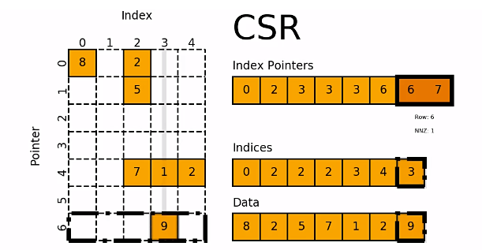
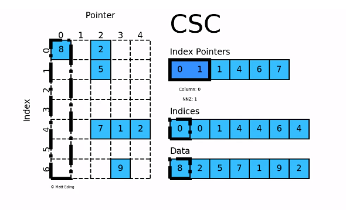

https://zhuanlan.zhihu.com/p/188700729


源代码实现

https://github.com/scipy/scipy/blob/3b36a574dc657d1ca116f6e230be694f3de31afc/scipy/sparse/sparsetools/csr.h#L376

https://github.com/scipy/scipy/blob/3b36a574dc657d1ca116f6e230be694f3de31afc/scipy/sparse/sparsetools/csc.h#L111

https://github.com/scipy/scipy/blob/main/scipy/sparse/sparsetools/coo.h

https://github.com/scipy/scipy/blob/main/scipy/sparse/sparsetools/csr.h


###  CSR - [csr_matrix](https://link.zhihu.com/?target=https%3A//docs.scipy.org/doc/scipy/reference/generated/scipy.sparse.csr_matrix.html)

### Compressed Sparse Row Matrix 压缩稀疏行格式

- csr_matrix是按行对矩阵进行压缩的

- 通过 `indices`, `indptr`，`data` 来确定矩阵。

- `data` 表示矩阵中的非零数据

- 对于第 `i` 行而言，该行中非零元素的列索引为 `indices[i]`，第i个元素在第`indices[i]`列。

- 可以将 `indptr` 理解每行的元素个数，`len(indptr)` = `len(data) + 1`。作差得到某行元素个数。

- 根据`indptr[i+1] - indptr[i]`，我就得到了该行中的非零元素个数，如

- - 若 `index[i] = 3` 且 `index[i+1] = 3` ，则第 `i` 行的没有非零元
  - 
- 、素
  - 若 `index[j] = 6` 且 `index[j+1] = 7` ，则第 `j` 行的非零元素的列索引为 `indices[6:7]`
  
- 得到了行索引、列索引，相应的数据存放在： `data[indptr[i]:indptr[i+1]]`

'


- 对于矩阵第 `0` 行，我们需要先得到其非零元素列索引

- - 由 `indptr[0] = 0` 和 `indptr[1] = 2` 可知，作差可知第 `0` 行有两个非零元素。
  - 它们的列索引为 `indices[0:1] = [0, 2]` ，且存放的数据为 `data[0] = 8` ， `data[1] = 2`
  - 因此矩阵第 `0` 行的非零元素 `csr[0][0] = 8` 和 `csr[0][2] = 2`

- 对于矩阵第 `4` 行，同样我们需要先计算其非零元素列索引

- - 由 `indptr[4] = 3` 和 `indptr[5] = 6` 可知，第 `4` 行有3个非零元素。
  - 它们的列索引为 `indices[3:5cla] = [2, 3，4]` ，且存放的数据为 `data[3] = 7` ，`data[4] = 1` ，`data[5] = 2`
  - 因此矩阵第 `4` 行的非零元素 `csr[4][2] = 7` ， `csr[4][3] = 1` 和 `csr[4][4] = 2`

-----


### .CSC - [csc_matrix](https://link.zhihu.com/?target=https%3A//docs.scipy.org/doc/scipy/reference/generated/scipy.sparse.csc_matrix.html)

### Compressed Sparse Column Matrix 压缩稀疏列矩阵

- csc_matrix是按列对矩阵进行压缩的

- 通过 `indices`, `indptr`，`data` 来确定矩阵，可以对比CSR

- `data` 表示矩阵中的非零数据

- 对于第 `i` 列而言，该行中非零元素的行索引为`indices[indptr[i]:indptr[i+1]]`

- 可以将 `indptr` 理解成利用其自身索引 `i` 来指向第 `i` 列元素的列索引

- 根据`[indptr[i]:indptr[i+1]]`，我就得到了该行中的非零元素个数，如

- - 若 `index[i] = 1` 且 `index[i+1] = 1` ，则第 `i` 列的没有非零元素
  - 若 `index[j] = 4` 且 `index[j+1] = 6` ，则第 `j`列的非零元素的行索引为 `indices[4:6]`

- 得到了列索引、行索引，相应的数据存放在： data[indptr[i]:indptr[i+1]]




- 对于矩阵第 `0` 列，我们需要先得到其非零元素行索引

- - 由 `indptr[0] = 0` 和 `indptr[1] = 1` 可知，第 `0`列行有1个非零元素。
  - 它们的行索引为 `indices[0:1] = [0]` ，且存放的数据为 `data[0] = 8`
  - 因此矩阵第 `0` 行的非零元素 `csc[0][0] = 8`

- 对于矩阵第 `3` 列，同样我们需要先计算其非零元素行索引

- - 由 `indptr[3] = 4` 和 `indptr[4] = 6` 可知，第 `4` 行有2个非零元素。
  - 它们的行索引为 `indices[4:6] = [4, 6]` ，且存放的数据为 `data[4] = 1` ，`data[5] = 9`
  - 因此矩阵第 `i` 行的非零元素 `csr[4][3] = 1` ， `csr[6][3] = 9`


```c++

```

