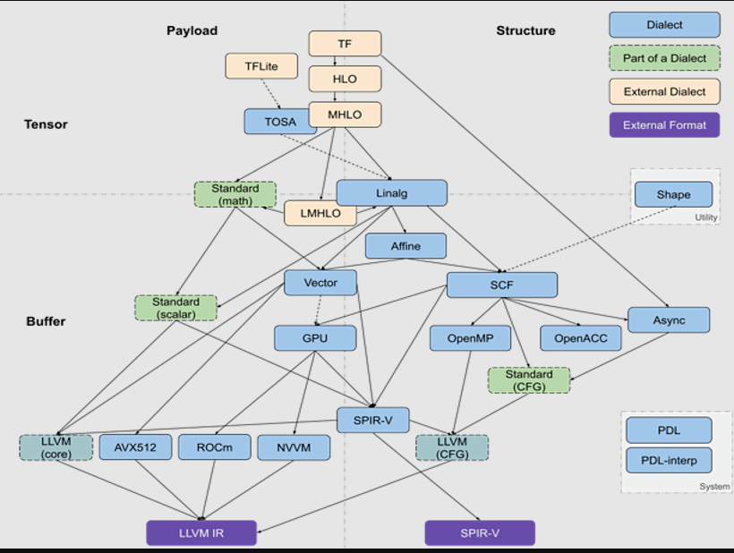

https://blog.csdn.net/googledevs/article/details/89311824

# MLIR 发布：全新的中介码与编译器框架

[TensorFlow](https://so.csdn.net/so/search?q=TensorFlow&spm=1001.2101.3001.7020) 生态系统包含许多编译器和优化器，可在多个级别的软硬件堆栈上运行。作为 TensorFlow 的日常用户，在使用不同种类的硬件（GPU、TPU、移动设备）时，这种多级别堆栈可能会表现出令人费解的编译器和运行时错误。

 

首先，我们通过下图为您概述这些组件：

个人理解，定义各种IR（通过统一的Dialect）的一种语言。

说明：事实上，这种[堆栈](https://so.csdn.net/so/search?q=堆栈&spm=1001.2101.3001.7020)的复杂性更胜此图。

 

如图中所示，TensorFlow 图 [1] 能够以多种不同的方式运行。这包括：

- 将其发送至调用手写运算内核的 TensorFlow 执行器
- 将图转化为 XLA 高级优化器 (XLA HLO) 表示，反之，这种表示亦可调用适合 CPU 或 GPU 的 LLVM 编辑器，或者继续使用适合 TPU 的 XLA。（或者将二者结合！）
- 将图转化为 TensorRT、nGraph 或另一种适合特定硬件指令集的[编译器](https://so.csdn.net/so/search?q=编译器&spm=1001.2101.3001.7020)格式
- 将图转化为 TensorFlow Lite 格式，然后在 TensorFlow Lite 运行时内部执行此图，或者通过 Android 神经网络 API (NNAPI) 或相关技术将其进一步转化，以在 GPU 或 DSP 上运行

 

此外，您甚至可选用更复杂的途径，包括在每层中执行多轮优化。例如，Grappler 框架现在便能优化 TensorFlow 中的张量布局和运算。

 

虽然这些编译器和表示的大量实现可显著提升性能，但这种异构的环境可能会给最终用户带来问题，例如在这些系统间的边界处产生令人困惑的错误消息。此外，若需要构建新的软硬件堆栈生成器，则必须为每个新路径重新构建优化与转换传递。

 

鉴于此，我们发布 MLIR（或称为多级别中介码）。这是一种表示格式和编译器实用工具库，介于模型表示和低级编译器/执行器（二者皆可生成硬件特定代码）之间。在生产质量组件的支持下，我们希望能够借助 MLIR 对优化编译器设计与实现进行全新探索。

 

我们预计 MLIR 会引起许多团队的注意，包括：

- 希望优化机器学习模型性能与内存消耗的编译器研究者和实现者
- 正在寻找一种方式将硬件连接至 TensorFlow 的硬件制造商，例如 TPU、手机中可移植的神经网络硬件以及其他自定义专用集成电路 (ASIC)
- 编写语言绑定的人士，他们希望能充分利用优化编译器和硬件加速

**什么是 MLIR？**

MLIR 的核心是一种灵活的基础设施，适用于现代优化编译器。这意味着其中包含适用于中介码 (IR) 的规范与转换此中介码的代码工具包。（从编译器的角度来说，从高级表示到低级表示的转换过程称为 “降阶”，下文我们将使用此术语。）

 

MLIR 深受 LLVM 的影响，并不折不扣地重用其许多优秀理念。MLIR 拥有灵活的类型系统，可在同一编译单元中表示、分析和转换结合多层抽象的图。这些抽象包括 TensorFlow 运算、嵌套的多面循环区域乃至 LLVM 指令和固定的硬件操作及类型。

注：LLVM 链接 https://llvm.org/

***\*MLIR 方言\****

为区分不同的硬件与软件受众，MLIR 提供 “方言”，其中包括：

- TensorFlow IR，代表 TensorFlow 图中可能存在的一切
- XLA HLO IR，旨在利用 XLA 的编译功能（输出到 TPU 等）
- 实验性仿射方言，侧重于多面表示与优化
- LLVM IR，与 LLVM 自我表示之间存在 1:1 映射，可使 MLIR 通过 LLVM 发出 GPU 与 CPU 代码
- TensorFlow Lite，将会转换以在移动平台上运行代码

 

每种方言均由一组存在不变性的已定义操作组成，如：“这是一个二进制运算符，输入与输出拥有相同类型。”

***\*添加至 MLIR\****

MLIR 没有众所周知的固定或内置的操作列表（无 “内联函数”）。方言可完全定义自定义类型，即 MLIR 如何对 LLVM IR 类型系统（拥有一流汇总）、域抽象（对量化类型等经机器学习 (ML) 优化的加速器有着重要意义），乃至未来的 Swift 或 Clang 类型系统（围绕 Swift 或 Clang 声明节点而构建）进行建模。

 

如果您想要连接新的低级编译器，则需要创建新方言，以及 TensorFlow 图方言与您的方言之间的降阶。如此一来，硬件及编译器制造商便可一路畅行。您甚至可以在同一个模型中定位不同级别的方言；高级优化器将尊重 IR 中不熟悉的部分，并等待较低级别的优化器来处理此类部分。

 

如果您是编译器研究者和框架制造者，则可以借助 MLIR 在每个级别进行转换，甚至是在 IR 中定义自己的操作和抽象，从而针对您试图解决的问题领域构建最佳模型。由此看来，MLIR 比 LLVM 更像是纯编译器基础设施。

 

虽然 MLIR 充当 ML 的编译器，但我们也看到，MLIR 同样支持在编译器内部使用机器学习技术！这一点尤为重要，因为在进行扩展时，开发数字库的工程师无法跟上 ML 模型或硬件的多样化速度。MLIR 的扩展性有助于探索代码降阶策略，并在抽象之间执行逐步降阶。

MLIR（Multi-Level Intermediate Representation），顾名思义，其核心是多级IR表示。与其说MLIR是一个深度学习编译器，不如说其是编译器的基础设施（类似LLVM），基于MLIR我们可以很快地构建自己的深度学习编译器/其他领域的DSC（Domain Specific Compiler）。

下图展示了现有的MLIR的生态，其中包括了许多Dialect（方言，即IR）。图中包含了TensorFlow的MLIR后端和完全基于MLIR实现的编译器IREE，不同编译器/不同后端会选择不同的Dialect和不同的Lowering路线。使用多级IR的好处：一方面可以用不同的Dialect表达不同的语义，比如用于表达形状信息的Shape Dialect和Tensor Dialect，以及用于表达Runtime执行信息的Async Dialect等；另一方面，Lowering时采用多级IR，可以在不同层级的IR表达不同的信息来满足不同的优化需求，比如在MHLO Dialect上可以做高级图优化（类似TVM的Relay IR），在LinAlg Dialect上可以做循环的融合（LinAlg上有循环信息），在Affine Dialect上可以做Tiling之后的小矩阵乘的映射。同时MLIR提供了完整的Dynamic Shape的支持。

MLIR的生态优势在于开放性和灵活性，我们可以灵活地从MLIR内置Dialect中选择我们需要的Dialect，或者按我们的需求自定义Dialect。同时基于MLIR的基础设施，我们可以复用大量MLIR中的Pass来构建我们的编译器，这大大减少了构建编译器的工作量。

原文網址：https://dyfocus.com/marvel/20e878.html

**未来动态**

我们已开放 GitHub 代码库，欢迎关注（查看我们的 教程）。未来几个月内，我们将发布此工具包的更多内容，包括适用于 TensorFlow 与 TF Lite 方言的规范。我们期待向您展示更多与之相关的内容；如需了解详情，您可以在 c4ml 上查看 Chris Lattner 的 演讲稿，也可参阅我们在 GitHub 上的 README（https://github.com/tensorflow/mlir）。

注：GitHub 代码库 链接

https://github.com/tensorflow/mlir

教程 链接

https://github.com/tensorflow/mlir/blob/master/g3doc/Tutorials/Toy/Ch-1.md

演讲稿 链接

https://drive.google.com/file/d/1hUeAJXcAXwz82RXA5VtO5ZoH8cVQhrOK/view