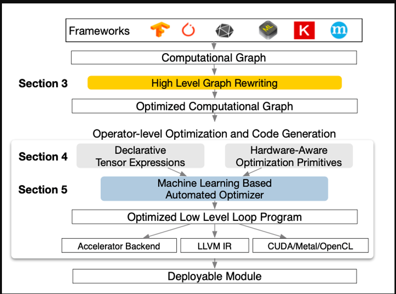

https://www.zhihu.com/question/300549540

### 蓝色的回答

op图到原语图

TVM整体架构如下图所示。TVM采用了两层IR，上层的Relay IR用于表达高级计算图，其中基本算子对应深度学习框架中的算子，在Relay IR上可以实现计算图层面的优化，如常量折叠、死结点消除等等；下层的TIR则用于表达具体计算（主要是for循环的表达）。TVM沿用了Halide的Compute-Schedule的概念，Compute是指计算语义，即一个算子要实现哪种计算效果，Schedule是指把计算语义映射到具体的计算逻辑上。如矩阵乘的计算语义是两层外层for循环加上内部一层做Reduction的for循环，但是实际做矩阵乘时我们可能会把这三层for循环做Tiling使得计算过程对Cache友好。类似的循环变换还有Loop Unroll、Loop Fusion等等，以及与硬件相关的变换如使用Shared Memory，这些变换都不会带来计算语义的变化，但是可能会给实际的计算过程带来加速。

在TVM中，对于一个算子可以选择不同的Schedule组合来得到不同的Kernel，这些Kernel的性能可能不一样，我们需要从中选择一个性能最好的。TVM提供了一个Auto-Tuning的框架，定义了Cost Model来预测一个具体的Schedule生成的Kernel的性能。基于TVM，我们可以在一定时间内从一个预先定义好/临时生成的Schedule组合空间中找到一个较优的Kernel实现。

总计来说，TVM中定义了良好的对循环进行操作的方法，并且提供了搜索较优Kernel实现的框架。实测来看，TVM对于计算密集的算子（如Conv2d、Matmul等）有较好的效果，但也存在着一些局限性：一方面是动态形状（Dynamic Shape）的支持，TVM中的算子定义都是静态形状的，即使之后的TVM Nimble通过一层VM来包住Runtime，但是对动态形状的整体支持还是不够完善；另一方面是Auto-Tensorize，由于目前硬件都逐渐支持了矩阵乘指令（比如CUDA的TensorCore），TVM目前两层IR的形式无法很好地表达Tiling之后的小矩阵乘，即拆成TIR之后就无法再识别出来它仍然是个矩阵乘。

原文網址：https://dyfocus.com/marvel/20e878.html

