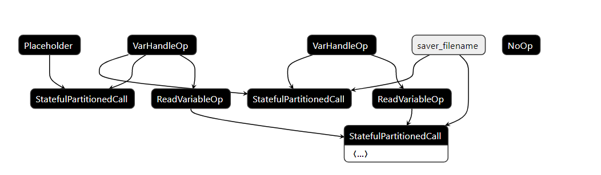
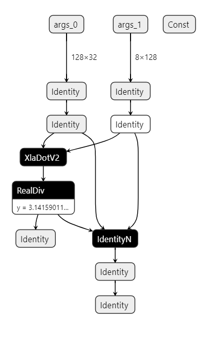

python2.1 测试通过

```python
import tensorflow as tf
import os

path="save_model"
exported = tf.train.Checkpoint(v=tf.Variable(3.))
exported.f = tf.function(
    lambda x: exported.v * x;,
    input_signature=[tf.TensorSpec(shape=None, dtype=tf.float32)])
tf.saved_model.save(exported, path)
imported = tf.saved_model.load(path)
assert 3. == imported.v.numpy()
assert 6. == imported.f(x=tf.constant(2.)).numpy()
```




```python
.
├── save_model
│   ├── assets
│   ├── saved_model.pb
│   └── variables
│       ├── variables.data-00000-of-00001
│       └── variables.index
├── test.py
└── tmp
    └── tf_dump_graph
        ├── before_increase_dynamism_for_auto_jit_pass_10.pbtxt
        ├── before_increase_dynamism_for_auto_jit_pass_11.pbtxt
        ├── before_increase_dynamism_for_auto_jit_pass_12.pbtxt
        ├── before_increase_dynamism_for_auto_jit_pass_13.pbtxt
        ├── before_increase_dynamism_for_auto_jit_pass_14.pbtxt
        ├── before_increase_dynamism_for_auto_jit_pass_15.pbtxt
        ├── before_increase_dynamism_for_auto_jit_pass_16.
        ├── before_increase_dynamism_for_auto_jit_pass_17.pbtxt
        ├── before_increase_dynamism_for_auto_jit_pass_18.pbtxt
        ├── before_increase_dynamism_for_auto_jit_pass_19.pbtxt
        ├── before_increase_dynamism_for_auto_jit_pass_1.pbtxt
        ├── before_increase_dynamism_for_auto_jit_pass_20.pbtxt
        ├── before_increase_dynamism_for_auto_jit_pass_21.pbtxt
        ├── before_increase_dynamism_for_auto_jit_pass_22.pbtxt
        ├── before_increase_dynamism_for_auto_jit_pass_23.pbtxt
        ├── before_increase_dynamism_for_auto_jit_pass_2.pbtxt
        ├── before_increase_dynamism_for_auto_jit_pass_3.pbtxt
        ├── before_increase_dynamism_for_auto_jit_pass_4.pbtxt
        ├── before_increase_dynamism_for_auto_jit_pass_5.pbtxt
        ├── before_increase_dynamism_for_auto_jit_pass_6.pbtxt
        ├── before_increase_dynamism_for_auto_jit_pass_7.pbtxt
        ├── before_increase_dynamism_for_auto_jit_pass_8.pbtxt
        ├── before_increase_dynamism_for_auto_jit_pass_9.pbtxt
        ├── before_increase_dynamism_for_auto_jit_pass.pbtxt
        ├── before_mark_for_compilation_10.pbtxt
        ├── before_mark_for_compilation_1.pbtxt
        ├── before_mark_for_compilation_2.pbtxt
        ├── before_mark_for_compilation_3.pbtxt
        ├── before_mark_for_compilation_4.pbtxt
        ├── before_mark_for_compilation_5.pbtxt
        ├── before_mark_for_compilation_6.pbtxt
        ├── before_mark_for_compilation_7.pbtxt
        ├── before_mark_for_compilation_8.pbtxt
        ├── before_mark_for_compilation_9.pbtxt
        ├── before_mark_for_compilation.pbtxt
        ├── mark_for_compilation_10.pbtxt
        ├── mark_for_compilation_1.pbtxt
        ├── mark_for_compilation_2.pbtxt
        ├── mark_for_compilation_3.pbtxt
        ├── mark_for_compilation_4.pbtxt
        ├── mark_for_compilation_5.pbtxt
        ├── mark_for_compilation_6.pbtxt
        ├── mark_for_compilation_7.pbtxt
        ├── mark_for_compilation_8.pbtxt
        ├── mark_for_compilation_9.pbtxt
        ├── mark_for_compilation_annotated_10.pbtxt
        ├── mark_for_compilation_annotated_1.pbtxt
        ├── mark_for_compilation_annotated_2.pbtxt
        ├── mark_for_compilation_annotated_3.pbtxt
        ├── mark_for_compilation_annotated_4.pbtxt
        ├── mark_for_compilation_annotated_5.pbtxt
        ├── mark_for_compilation_annotated_6.pbtxt
        ├── mark_for_compilation_annotated_7.pbtxt
        ├── mark_for_compilation_annotated_8.pbtxt
        ├── mark_for_compilation_annotated_9.pbtxt
        ├── mark_for_compilation_annotated.pbtxt
        └── mark_for_compilation.pbtxt

5 directories, 61 files

```


使用v1方法读入pb文件

`/home/ken/workspace/test/jax/pb_test`

```python
import tensorflow as tf

with tf.io.gfile.GFile("./tf_tmp/fn_hlo.pb", "rb") as f:
    graph_def = tf.compat.v1.GraphDef()
    loaded = graph_def.ParseFromString(f.read())

    tf.import_graph_def(graph_def, name='')
    graph_nodes=[n for n in graph_def.node]
    names = []
    for t in graph_nodes:
        names.append(t.name)

    print(names)

```


```python
['args_0', 'args_1', 'y', 'x', 'jax2tf_arg_0', 'jax2tf_arg_1', 'jax2tf_ordered_wrapper_/jit_dot_/XlaDotV2', 'Const', 'Const_1', 'jax2tf_ordered_wrapper_/jit_true_divide_/truediv', 'Identity', 'IdentityN', 'jax2tf_out', 'Identity_1']

```


 下图为`fb_hlo.pb`




`load_pb`是对的，但对变量的解析还是有问题的。

```python
import tensorflow as tf

def load_pb(path_to_pb):
    with tf.io.gfile.GFile(path_to_pb, "rb") as f:
        graph_def = tf.compat.v1.GraphDef()
        graph_def.ParseFromString(f.read())
    with tf.Graph().as_default() as graph:
        tf.import_graph_def(graph_def, name='')

        graph_nodes=[n for n in graph_def.node]
        names = []
        for t in graph_nodes:
            names.append(t.name)

        print(names)

        return graph

graph = load_pb("./tf_tmp/fn_hlo.pb")
input1 = graph.get_tensor_by_name('Identity:y')
#input2 = graph.graph.get_tensor_by_name('input:y')

#    output = graph.graph.get_tensor_by_name('input:y')

```

