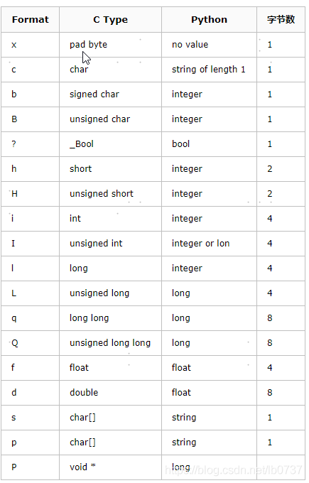
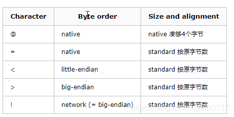

# Python中struct.pack()和struct.unpack()用法详细说明

https://blog.csdn.net/weiwangchao_/article/details/80395941


struct.pack 返回tuple，相当于数组。




```python
import  struct
# native byteorder
buffer  =  struct.pack( "ihb" ,  1 ,  2 ,  3 )
print  repr ( buffer )
print  struct.unpack( "ihb" ,  buffer )
# data from a sequence, network byteorder
data  =  [ 1 ,  2 ,  3 ]
buffer  =  struct.pack( "!ihb" ,  * data)
print  repr ( buffer )
print  struct.unpack( "!ihb" ,  buffer )
  
Output:
'\x01\x00\x00\x00\x02\x00\x03'
( 1 ,  2 ,  3 )
'\x00\x00\x00\x01\x00\x02\x03'
( 1 ,  2 ,  3 )
```

首先将参数1,2,3打包，打包前1,2,3明显属于python数据类型中的integer,pack后就变成了C结构的二进制串，转成 python的string类型来显示就是　　'\x01\x00\x00\x00\x02\x00\x03'。由于本机是小端('little- endian',关于大端和小端的区别请参照这里, 故而高位放在低地址段。i 代表C struct中的int类型，故而本机占4位，1则表示为01000000;h 代表C struct中的short类型，占2位，故表示为0200;同理b 代表C struct中的signed char类型，占1位，故而表示为03。

其他结构的转换也类似，有些特别的可以参考官方文档的Manual。

在Format string 的首位，有一个可选字符来决定大端和小端，列表如下：



如果没有附加，默认为@，即使用本机的字符顺序(大端or小端)，对于C结构的大小和内存中的对齐方式也是与本机相一致的(native)，比如有的机器integer为2位而有的机器则为四位;有的机器内存对其位四位对齐，有的则是n位对齐(n未知，我也不知道多少)。

还有一个标准的选项，被描述为：如果使用标准的，则任何类型都无内存对齐。

比如刚才的小程序的后半部分，使用的format string中首位为！，即为大端模式标准对齐方式，故而输出的为'\x00\x00\x00\x01\x00\x02\x03'，其中高位自己就被放在内存的高地址位了。
