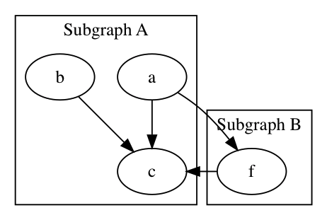

<h1 align="center">subgraph</h1>


## 一、subgraph语法

子图的使用方法：

| 123  | subgraph cluster* {  // xxxx  } |
| ---- | ------------------------------- |
|      |                                 |

子图的语法和其他语法也是一样的，一个千万要注意的地方是子图的命名必须以`cluster`开头。

例如：

```asm
digraph {
    subgraph cluster_0 {
        label="Subgraph A";
        a -> c;
        b -> c;
    }
 
    subgraph cluster_1 {
        label="Subgraph B";
        a -> f;
        f -> c;
    }
}
```


效果：



## 二、把箭头指向容器的办法

如果希望把箭头容器，而不是指向容器内部元素的话，需要使用以下两个属性：

| 123  | compound=true;// a和b分别表示箭头的头部和尾部xx -> yy [lhead=a ltail=b] |
| ---- | ------------------------------------------------------------ |
|      |                                                              |

要注意的是`compound=true`属性一定需要，它是全局代码段的。

例如修改上图中的**a到f**的线条为**a到子容器

```asm
digraph demo {
    compound=true;
    subgraph cluster_0 {
        label="Subgraph A";
        a -> c;
    }
 
    subgraph cluster_1 {
        label="Subgraph B";
        f -> c;
    }
 
    a -> f [lhead=cluster_1];
}
```


效果：

