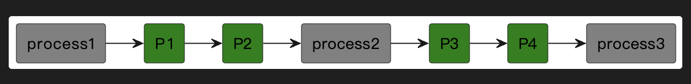
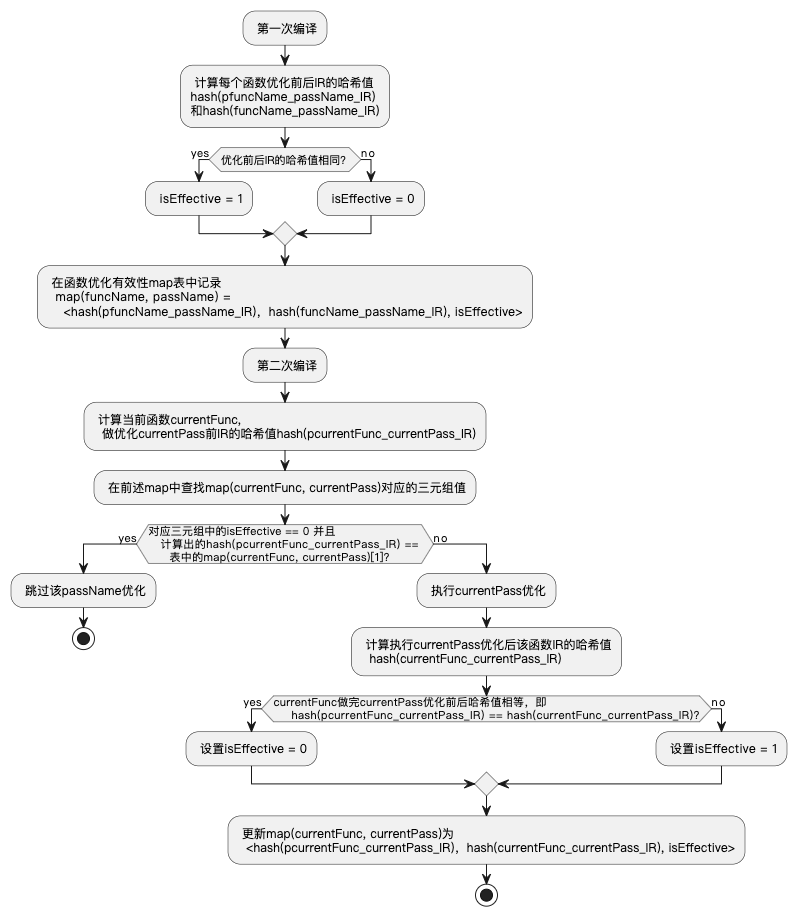

```
@startuml

rectangle process1 #Grey
rectangle process2 #Grey
rectangle process3 #Grey

rectangle P1 #Green
rectangle P2 #Green
rectangle P3 #Green
rectangle P4 #Green

process1 -r-> P1 
P1 -r-> P2
P2 -r-> process2
process2 -r-> P3
P3 -r-> P4
P4 -r-> process3

@enduml
```




```
@startuml

rectangle 源代码 #Green
rectangle 预处理 #Grey
rectangle 编译  #Grey
rectangle 汇编  #Grey
rectangle 链接  #Grey
rectangle 可执行程序 #Green

源代码 -r-> 预处理 
预处理 -r-> 编译
编译 -r-> 汇编
汇编 -r-> 链接
链接 -r-> 可执行程序

@enduml
```


```uml
@startuml
: 第一次编译;
: 计算每个函数优化前后IR的哈希值
hash(pfuncName_passName_IR)
和hash(funcName_passName_IR);
if (优化前后IR的哈希值相同? ) then (yes)
  : isEffective = 1;
else (no)
  : isEffective = 0; 
endif
: 在函数优化有效性map表中记录
  map(funcName, passName) = 
    <hash(pfuncName_passName_IR)，hash(funcName_passName_IR), isEffective>;
: 第二次编译;
: 计算当前函数currentFunc,
  做优化currentPass前IR的哈希值hash(pcurrentFunc_currentPass_IR);
: 在前述map中查找map(currentFunc, currentPass)对应的三元组值;
if (对应三元组中的isEffective == 0 并且
    计算出的hash(pcurrentFunc_currentPass_IR) == 
       表中的map(currentFunc, currentPass)[1]?) then (yes)
    : 跳过该passName优化;
    stop
else (no)
  : 执行currentPass优化;
  : 计算执行currentPass优化后该函数IR的哈希值
    hash(currentFunc_currentPass_IR);
  if (currentFunc做完currentPass优化前后哈希值相等，即
      hash(pcurrentFunc_currentPass_IR) == hash(currentFunc_currentPass_IR)?) then (yes)
    : 设置isEffective = 0;
  else (no)
    : 设置isEffective = 1;
  endif
  : 更新map(currentFunc, currentPass)为
    <hash(pcurrentFunc_currentPass_IR)，hash(currentFunc_currentPass_IR), isEffective>;
  stop
endif
@enduml
```





```

```


