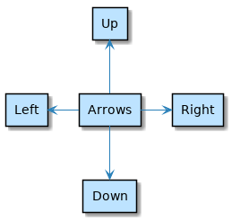

https://crashedmind.github.io/PlantUMLHitchhikersGuide/layout/layout.html

# 6. Layout

Tip

*It’s true that when diagram is big (or very big) manual placement could be useful. However and unfortunately, this is against PlantUML concept* https://forum.plantuml.net/977

Wrangling diagram elements to an exact position or layout is not what PlantUML is for.

However, there are **some layout tweak mechanisms that should be used sparingly**. These are described here.

## 6.1. Arrows for Layout

We can specify a connection direction as follows and this affects the diagram layout:

| Text                            | Direction                                             |
| ------------------------------- | ----------------------------------------------------- |
| `->`                            | horizontal left to right                              |
| `-->`                           | vertical top to bottom                                |
| `-up->` or `-u->`               | vertical bottom to top                                |
| `-down->` or `-d->`             | vertical top to bottom                                |
| `-left->` or `-l->`             | horizontal right to left                              |
| `-right->` or `-r->`            | horizontal left to right                              |
| `--norank]>`                    | make a connection less important                      |
| `--[hidden]>`                   | hidden                                                |
| `-[hidden]d->`                  | hidden with direction e.g. down                       |
| `--->` or `---->` or `----->` … | varying arrow lengths; add dashes to make line longer |

Tip

The order in which diagram elements are defined can also impact how they are laid out.

Tip

Arrow head stypes per https://plantuml.com/sequence-diagram are for sequence diagrams only i.e. won’t work in our component diagram examples.

## 6.2. up down left right

| ` 1 2 3 4 5 6 7 8 9 10 11 12 13 14` | `@startuml rectangle Arrows rectangle Up rectangle Down rectangle Left rectangle Right Arrows -u-> Up  Arrows -d-> Down Arrows -l-> Left Arrows -r-> Right @enduml ` |
| ----------------------------------- | ------------------------------------------------------------ |
|                                     |                                                              |

## 6.3. left to right direction

![@startuml  left to right direction 'top to bottom direction  rectangle Arrows rectangle A rectangle B rectangle C rectangle D rectangle E rectangle F  Arrows --> A  Arrows --> B Arrows --> C Arrows --> D Arrows --[hidden]> E  @enduml](study.assets/plantuml-3613326002478e6188b5ea74d16aff45e46a32e4.png)

| ` 1 2 3 4 5 6 7 8 9 10 11 12 13 14 15 16 17 18 19 20` | `@startuml left to right direction 'top to bottom direction rectangle Arrows rectangle A rectangle B rectangle C rectangle D rectangle E rectangle F Arrows --> A  Arrows --> B Arrows --> C Arrows --> D Arrows --[hidden]> E @enduml ` |
| ----------------------------------------------------- | ------------------------------------------------------------ |
|                                                       |                                                              |

## 6.4. top to bottom direction

![@startuml  'left to right direction top to bottom direction  rectangle Arrows rectangle A rectangle B rectangle C rectangle D rectangle E rectangle F  Arrows --> A  Arrows --> B Arrows --> C Arrows --> D Arrows --[hidden]> E  @enduml](study.assets/plantuml-328e7bf9ef79ca8d6196566abc708c995ddc81c5.png)

| ` 1 2 3 4 5 6 7 8 9 10 11 12 13 14 15 16 17 18 19 20` | `@startuml 'left to right direction top to bottom direction rectangle Arrows rectangle A rectangle B rectangle C rectangle D rectangle E rectangle F Arrows --> A  Arrows --> B Arrows --> C Arrows --> D Arrows --[hidden]> E @enduml ` |
| ----------------------------------------------------- | ------------------------------------------------------------ |
|                                                       |                                                              |

## 6.5. hidden

Note

Note that the location of E is determined by a hidden arrow. Whereas F is floating i.e. not connected by an arrow so it can go anywhere.

## 6.6. nodesep and ranksep

![@startuml  'skinparam nodesep 10 'skinparam ranksep 20  rectangle Arrows rectangle A rectangle B rectangle C rectangle D rectangle E rectangle F  Arrows -[bold]-> A  Arrows -[#pink,dashed,thickness=10]-> B Arrows -[#4567ff,dotted]-> C Arrows --> D E ---> C  @enduml](study.assets/plantuml-24c4181ee0e0c495c913c5703a71e6503af73bc0.png)

| ` 1 2 3 4 5 6 7 8 9 10 11 12 13 14 15 16 17 18 19 20` | `@startuml 'skinparam nodesep 10 'skinparam ranksep 20 rectangle Arrows rectangle A rectangle B rectangle C rectangle D rectangle E rectangle F Arrows -[bold]-> A  Arrows -[#pink,dashed,thickness=10]-> B Arrows -[#4567ff,dotted]-> C Arrows --> D E ---> C @enduml ` |
| ----------------------------------------------------- | ------------------------------------------------------------ |
|                                                       |                                                              |

![@startuml  skinparam nodesep 5 'skinparam ranksep 20  rectangle Arrows rectangle A rectangle B rectangle C rectangle D rectangle E rectangle F  Arrows -[bold]-> A  Arrows -[#pink,dashed,thickness=10]-> B Arrows -[#4567ff,dotted]-> C Arrows --> D E ---> C  @enduml](study.assets/plantuml-b11497574b50086a1f14e9551b0a01c1701d72d9.png)

| ` 1 2 3 4 5 6 7 8 9 10 11 12 13 14 15 16 17 18 19 20` | `@startuml skinparam nodesep 5 'skinparam ranksep 20 rectangle Arrows rectangle A rectangle B rectangle C rectangle D rectangle E rectangle F Arrows -[bold]-> A  Arrows -[#pink,dashed,thickness=10]-> B Arrows -[#4567ff,dotted]-> C Arrows --> D E ---> C @enduml ` |
| ----------------------------------------------------- | ------------------------------------------------------------ |
|                                                       |                                                              |

![@startuml  'left to right direction 'top to bottom direction  'skinparam nodesep 10 skinparam ranksep 150  rectangle Arrows rectangle A rectangle B rectangle C rectangle D rectangle E rectangle F  Arrows -[bold]-> A  Arrows -[#pink,dashed,thickness=10]-> B Arrows -[#4567ff,dotted]-> C Arrows --> D  'long arrow for no good reason  E ---> C   @enduml](study.assets/plantuml-ea2480c6c4f0473032e04684113a113ddc755f80.png)

| ` 1 2 3 4 5 6 7 8 9 10 11 12 13 14 15 16 17 18 19 20 21 22 23 24 25` | `@startuml 'left to right direction 'top to bottom direction 'skinparam nodesep 10 skinparam ranksep 150 rectangle Arrows rectangle A rectangle B rectangle C rectangle D rectangle E rectangle F Arrows -[bold]-> A  Arrows -[#pink,dashed,thickness=10]-> B Arrows -[#4567ff,dotted]-> C Arrows --> D 'long arrow for no good reason  E ---> C  @enduml ` |
| ------------------------------------------------------------ | ------------------------------------------------------------ |
|                                                              |                                                              |

## 6.7. together

D,E are forced together.

E-C is specified as a very long arrow

![@startuml  rectangle Arrows rectangle A rectangle B rectangle C together { rectangle D rectangle E } rectangle F   Arrows -[bold]-> A  Arrows -[#4567ff,dotted]-> C Arrows -[#pink,dashed,thickness=10]-> B Arrows --> D E ---------> C  @enduml](study.assets/plantuml-06436b83d5a6e8ea43ac578124b9cfc6a7cd225d.png)

| ` 1 2 3 4 5 6 7 8 9 10 11 12 13 14 15 16 17 18 19 20` | `@startuml rectangle Arrows rectangle A rectangle B rectangle C together { rectangle D rectangle E } rectangle F  Arrows -[bold]-> A  Arrows -[#4567ff,dotted]-> C Arrows -[#pink,dashed,thickness=10]-> B Arrows --> D E ---------> C @enduml ` |
| ----------------------------------------------------- | ------------------------------------------------------------ |
|                                                       |                                                              |

## 6.8. linetype polyline ortho

Either of the following can be added to a diagram:

- “skinparam linetype polyline”
- “skinparam linetype ortho”

See [Create Real Life AWS Diagrams](https://crashedmind.github.io/PlantUMLHitchhikersGuide/aws/aws.html#create-real-life-aws-diagrams) for practical examples of where these are used.

As at May 2020, it looks like there can be an issue using ortho. Specifically the label being too distant from the line.

- In our [AWSExample](http://www.plantuml.com/plantuml/uml/VL1BRnD13BxFhp1x8KXa8mfS8bGrH1Ng0GbfUPmdCsxMYkV1F99MLVyxJfPLAhJailRuUtpstkIYKwcErIloXgj5-AGFcMcpMFtgri6vuAydiOvSPBedj6qK_GH9rB4MN6Zc_r5Ss11VP6pHOz9yYV8bXHhlJF3v1KkzpZloKIVjWCbZUOm8-vZD9103FnuVQW8BgVH1gQZDJcyH6haTrXogRU19tQwlPftJ5X_UGZCqq67Qay569j2yKSzA_SYOykpqbU6fZkZtf2qL2bxpKOTfjhAt3wRNVej2MLaONwFYw-cVpOOYiszrmvHxJA1ZX93WW9kHEoJ3t8Q3dr_3e5d2knP-KgQI_vh1FD6sBy8uXo_XgeMkw5H0LtFSK9t1is2uUGdlM_XC5XB-hfWBBAJBCVYCQc30dF6-lDZXWxZtuI29uvB_MdviuSv5ySaIBew6oUoaaiz5Cqk7U_G5diPGii_g1hsjZly0) the label “4. Show Ad” is too far from the line to be useful.
- issue seen by other users: https://forum.plantuml.net/1608/is-it-possible-to-only-use-straight-lines-in-a-class-diagram

[Next ](https://crashedmind.github.io/PlantUMLHitchhikersGuide/diagramAnnotation/diagramAnnotation.html)[ Previous](https://crashedmind.github.io/PlantUMLHitchhikersGuide/color/color.html)