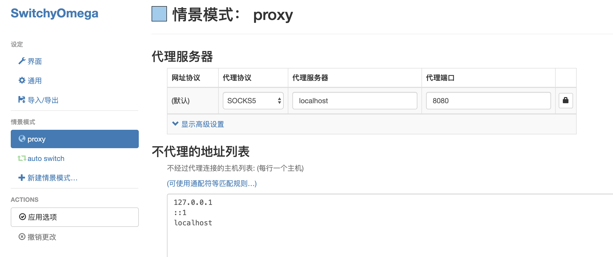
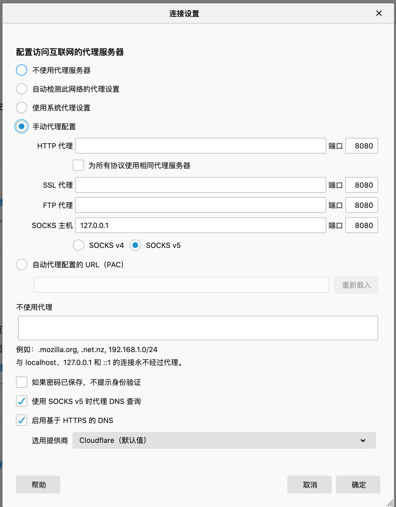

<h1 align="center">设置代理proxy</h1>
# 命令行

```shell
alias vpn="ssh -D localhost:8080 lep824e1v -N"
alias vpn1="ssh -D localhost:8080 recycler -N"
```


# Chrome



##### 修改完上述设置后，必须使修改生效。点击左下角的`应用选项`使个性生效。


### 使用Chrome ProxyOmega代理扩展

<https://zww.me/archives/25289>

<http://www.xstui.com/read/790>

#### 可在规则列表中代入如下网站，使用别人提供的规则。

`Auto switch` 选择AutoProxy

```
https://raw.githubusercontent.com/gfwlist/gfwlist/master/gfwlist.txt
```


https://github.com/FelisCatus/SwitchyOmega/releases 可以下载crx

 

##### 导入导出中进行备份

可从 `/Users/ken/Documents/Chrome/OmegaOptions.bak`导入备份。


# Firefox

192.168.5.10

`首选项 --> 设置`

