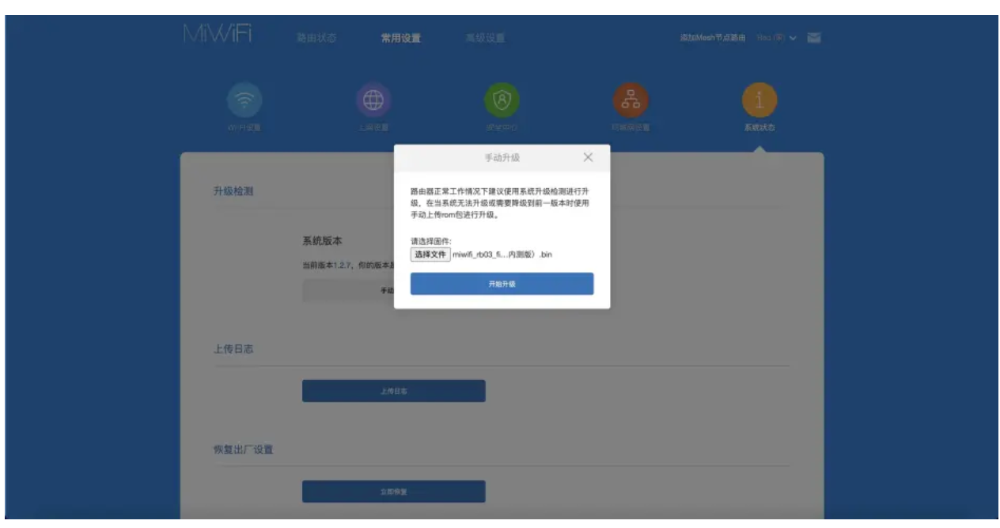
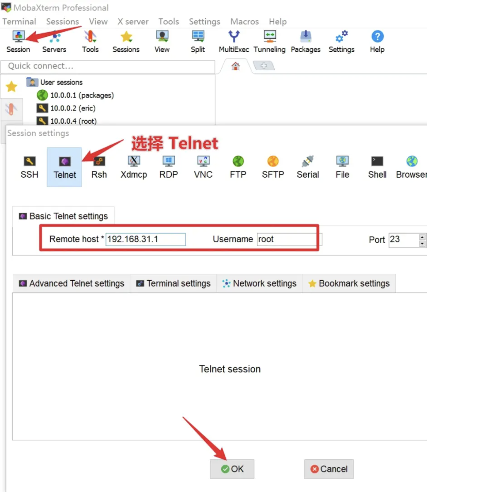

https://www.bilibili.com/read/cv22327855/

https://qust.me/post/ax6s/   刷机+翻墙

2023年3月11日凌晨，把白天收藏的教程拿出来，选择了一个看起来还不错的版本开始准备刷入，现在刷完了，界面十分清爽，功能多种多样，我很喜欢。

声明：本文大部分转载自https://supes.top/红米ax6s-解锁ssh-刷openwrt教程/，有些许地方不太一样

首先下载好需要的工具和固件包

https://op.supes.top/tools/ 里面的红米AX6S包，

https://supes.top/?version=22.03&target=mediatek%2Fmt7622&id=xiaomi_redmi-router-ax6s里面的第一个后缀为...sysupgrade.bin的文件，

下面的步骤都会用到里面的文件

前置条件：官方固件，未刷入过其他版本固件


### 1. 降级小米固件至开发版
在小米官方固件后台 (默认为 192.168.31.1) `常用设置->系统状态->手动升级` 中 上传 miwifi_rb03_firmware_stable_1.2.7（内测版）.bin 并刷入更新固件。




### 2. 解锁SSH
打开 https://www.oxygen7.cn/miwifi/ 输入路由器后面标签上完整的SN号, 计算得到root密码

我是使用的https://miwifi.dev/ssh这个网站计算的，因为上面的网址好像无法访问了

#### 2.1 利用telnet登陆到路由器

##### 2.1.1 windows使用MobaXterm 软件

新建telnet
登录telnet




##### ##### 2.1.2 macOS需要用telnet命令

使用`brew install telnet`安装该命令，但10.15中无该命令，可以在csdn上下载10.13的telnet命令。

https://download.csdn.net/download/zl541907196/10498325 这里有个telent的下载地址，亲测可用。

```shell
./telnet 192.168.31.1
然后根据提示输入用户名和密码。
```


#### 2.3 解锁ssh

复制这三条命令, 粘贴回车执行:

```shell
nvram set ssh_en=1 & nvram set uart_en=1 & nvram set boot_wait=on & nvram set bootdelay=3 & nvram set flag_try_sys1_failed=0 & nvram set flag_try_sys2_failed=1

nvram set flag_boot_rootfs=0 & nvram set "boot_fw1=run boot_rd_img;bootm"

nvram set flag_boot_success=1 & nvram commit & /etc/init.d/dropbear enable & /etc/init.d/dropbear start
```


### 3 刷入 OPENWRT FACTORY.BIN 过渡包

利用`ssh` `mobaxterm` `winscp`等，将`factory.bin`上传到`tmp`目录下。

下面是macOS使用的命令：

```shell
scp factory.bin root@192.168.31.1:/tmp
密码同telnet密码
```


使用ssh/telent登陆到路由器后，执行刷入命令：

```shell
mtd -r write /tmp/factory.bin firmware
```


建议使用**ax6s-326o.zip**中的factory.bin和ax6s-full.bin。


### 4. 刷入 OPENWRT 正式固件

等路由器自动重启, 蓝灯常亮后, 连接OpenWrt wifi， 浏览器打开 10.0.0.1 进入后台，默认密码 root 

如果是windows系统连不上的话，选择IPv4中自动获取IP和DNS。

如果不知道路由器的ip地址，可以用`ipconfig/ifconfig`，其中的默认网关的地址就是路由器IP，如果ping不通的话，可以设置电脑自动获取IP。

应该与factory.bin相对应。


上传更新固件


等待路由器自动重启完成,蓝灯常亮后,会自动跳转到后台登录界面, 或手动输入后台地址 op/ 或 10.0.0.1

登录后台, 默认密码 root ,打完收工, Enjoy~

后台页面


