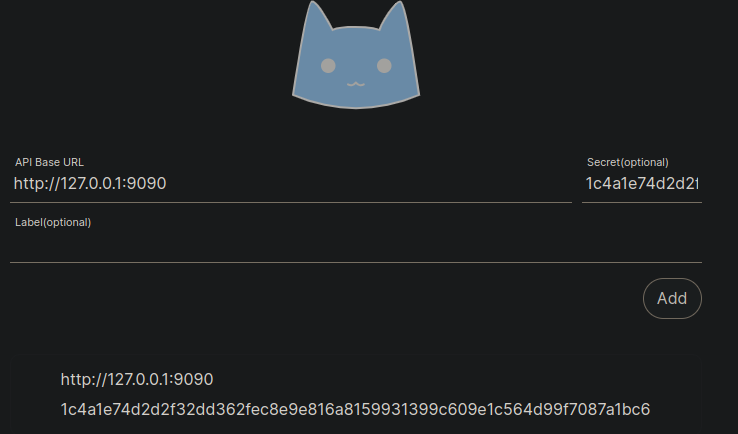
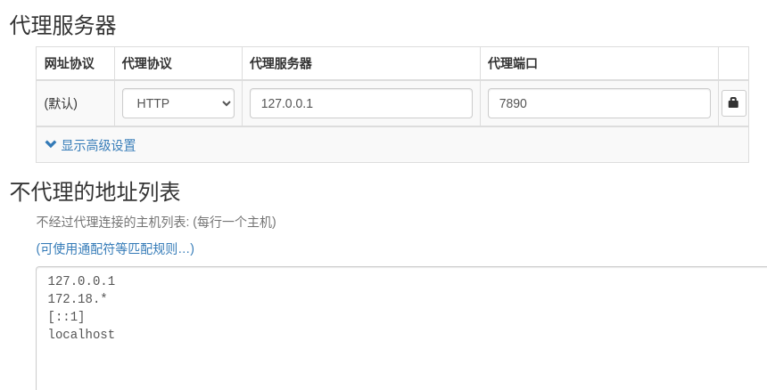

<h1 align="center">clash for linux</h1>


下面的项目已在ubuntu 22.04上测试成功


https://github.com/wnlen/clash-for-linux  可以根据项目中的README.md来进行安装


### 1. 设置

```shell
cd clash-for-linux
vim .env  # 在.env文件中写上订阅链接
```


以下为`.env`文件中的内容

```
# Clash 订阅地址
export CLASH_URL='更改为你的clash订阅地址'
export CLASH_SECRET=''
```


 `.env` 文件中的变量 `CLASH_SECRET` 为自定义 Clash Secret，值为空时，脚本将自动生成随机字符串。


### 2. 启动程序

```shell
sudo bash start.sh


以下为输出日志：
CPU architecture: amd64                                                                                                                                                       
                                                                                                                                                                              
正在检测订阅地址...                                                                                                                                                           
Clash订阅地址可访问！                                      [  OK  ]                                                                                                           
                                                                                                                                                                              
正在下载Clash配置文件...                                                                                                                                                      
配置文件config.yaml下载成功！                              [  OK  ]                    

判断订阅内容是否符合clash配置文件标准:
解码后的内容不符合clash标准，尝试将其转换为标准格式                                    
配置文件已成功转换成clash标准格式

正在启动Clash服务...                       
服务启动成功！                                             [  OK  ]                    

Clash Dashboard 访问地址: http://<ip>:9090/ui                                          
Secret: 03712b9fba6aadf2c4d4a183cad1043e6450a13b1853be020a234c378fdf69f6               

请执行以下命令加载环境变量: source /etc/profile.d/clash.sh                             

请执行以下命令开启系统代理: proxy_on

若要临时关闭系统代理，请执行: proxy_off
```


```shell
source /etc/profile.d/clash.sh   # 此脚本只有两个函数 proxy_on和proxy_off，就是设置代理的几条命令
proxy_on
```


`clash.sh`中的内容

> ```shell
> # 开启系统代理
> function proxy_on() {
>         export http_proxy=http://127.0.0.1:7890
>         export https_proxy=http://127.0.0.1:7890
>         export no_proxy=127.0.0.1,localhost
>         export HTTP_PROXY=http://127.0.0.1:7890
>         export HTTPS_PROXY=http://127.0.0.1:7890
>         export NO_PROXY=127.0.0.1,localhost
>         echo -e "\033[32m[√] 已开启代理\033[0m"
> }
> 
> # 关闭系统代理
> function proxy_off(){
>         unset http_proxy
>         unset https_proxy
>         unset no_proxy
>         unset HTTP_PROXY
>         unset HTTPS_PROXY
>         unset NO_PROXY
>         echo -e "\033[31m[×] 已关闭代理\033[0m"
> }
> ```


##### 检查服务端口

```shell
 netstat -tln | grep -E '9090|789.'
tcp        0      0 127.0.0.1:9090          0.0.0.0:*               LISTEN     
tcp6       0      0 :::7890                 :::*                    LISTEN     
tcp6       0      0 :::7891                 :::*                    LISTEN     
tcp6       0      0 :::7892                 :::*                    LISTEN
```


##### 检查环境变量

```shell
$ env | grep -E 'http_proxy|https_proxy'
http_proxy=http://127.0.0.1:7890
https_proxy=http://127.0.0.1:7890
```


### 3. 重启程序

如果需要对Clash配置进行修改，请修改 `conf/config.yaml` 文件。然后运行 `restart.sh` 脚本进行重启。

> **注意：** 重启脚本 `restart.sh` 不会更新订阅信息。


### 4. 停止程序

```shell
sudo bash shutdown.sh

服务关闭成功，请执行以下命令关闭系统代理：proxy_off
proxy_off
```


### 5. 使用GUI 

输入以下网址

```
http://127.0.0.1:9090/ui/
```




API Base URL中输入`http://127.0.0.1:9090`, 在Secret(optional)中输入运行`start.sh`的log中的secret，除非在`.env`中设置了secret。输入完成后占add，然后点下面新添加的内容，会跳到GUI管理页面。或者输入网址`http://127.0.0.1:9090/ui/`。


### 6. 使用代理(与代理同一主机)




### 7. 远程使用代理

以下为clash的内容，这里192.168.110.237为远程安装了上述clash的主机，假设本机ip是192.168.110.75


临时使用测试(多个IP的话，任一个IP都是可以用的)。

```
wget http://www.baidu.com -e "http_proxy=192.168.110.237:7890"
wget http://www.baidu.com -e "http_proxy=172.18.8.106:7890"
```


```shell
# 开启系统代理
function proxy_on() {
	export http_proxy=http://192.168.110.237:7890
	export https_proxy=http://192.168.110.237:7890
	export no_proxy=127.0.0.1,localhost
    	export HTTP_PROXY=http://192.168.110.237:7890
    	export HTTPS_PROXY=http://192.168.110.237:7890
 	export NO_PROXY=127.0.0.1,localhost
	echo -e "\033[32m[√] 已开启代理\033[0m"
}

# 关闭系统代理
function proxy_off(){
	unset http_proxy
	unset https_proxy
	unset no_proxy
  	unset HTTP_PROXY
	unset HTTPS_PROXY
	unset NO_PROXY
	echo -e "\033[31m[×] 已关闭代理\033[0m"
}
```


简化使用

```shell
. ./clash.sh
proxy_on
wget www.google.com 
```

