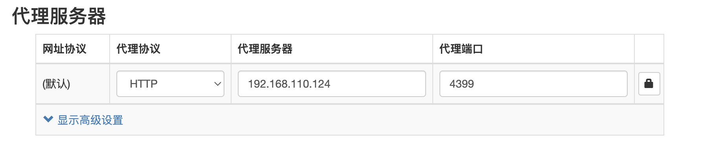
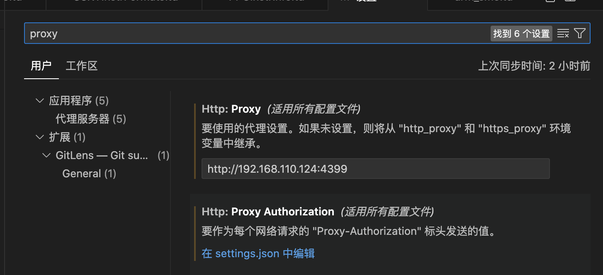

<h1 align="center">软件配置</h1>


以下在ubuntu上测试通过


https://bu1.github.io/2021/12/04/%E4%BD%BF%E7%94%A8Squid%E6%90%AD%E5%BB%BAHTTP%E4%BB%A3%E7%90%86%E6%9C%8D%E5%8A%A1%E5%99%A8/

https://www.yfname.com/help/detail/288

https://www.h2sheji.com/show-152.html


### 1. 安装

```
sudo apt-get install squid

sudo systemctl status squid     # 全部命令：{start|stop|status|reload|force-reload|restart|condrestart|try-restart|probe}
```


## 2. 设置网卡转发

一般已经开启，通常这里检查确认下就可以了。

首先要开启服务器网卡的数据转发功能，**0为关闭**，**1为开启**。

```
[root@Q1nghuan ~]# sysctl -a |grep -w ip_forward
net.ipv4.ip_forward = 0
```

> 临时生效： sysctl -w net.ipv4.ip_forward=1

修改`/etc/sysctl.conf`配置文件中的`net.ipv4.ip_forward`

```
[root@Q1nghuan ~]# vim /etc/sysctl.conf
```


刷新配置文件使之生效

```
[root@Q1nghuan ~]# sysctl -p
[root@Q1nghuan ~]# sysctl -a |grep -w ip_forward
net.ipv4.ip_forward = 1
```

Squid安装后默认设置为了拒绝所有服务器连接，只需要修改成所有服务器连接即可。

```
# vim /etc/squid/squid.conf
http_access allow all
```


## 3. 修改配置文件（未设置密码），此种方式很不安全，应该限制IP或者设置密码。

限制IP和设置密码，见本目录下安全下的文档。

```shell
# 允许访问所有地址，默认是 deny，这个要主动改一下
# And finally denay all other....
http_access allow all

# Squid normally listens to port 3128
# 代理服务器端口
#http_port 3128
http_port 4399    // 这里使用0.0.0.0:4399也是可以的
```


重启服务

```shell
sudo systemctl restart squid
sudo systemctl status squid
```


## 4. 浏览器使用代理

现在不需要输入任何命令，就可以在浏览器中设置http代理了。这里不能选择HTTPS



这里假设能上网的机器即安装squid的机器的ip是192.168.110.124。

如果squid设置了密码，可以点击右边的 锁 标志， 会提示输入用户名和密码。


### 5. 命令行使用代理(亲测)

##### ### 5.1 wget使用代理 

```shell
这里网站中的http与http_proxy必须对应。
wget http://www.baidu.com -e "http_proxy=192.168.110.124:4399"
wget https://www.baidu.com -e "https_proxy=192.168.110.124:4399"
```


如果在命令行中已经设置了export，则使用wget时无需再使用`-e`参数。

```shell
export http_proxy=192.168.110.124:4399
export https_proxy=192.168.110.124:4399
```


##### 5.2 pip使用代理(亲测)

```shell
pip install 包名  --proxy=192.168.110.124:4399
```


也可以使用

```shell
export http_proxy=192.168.110.124:4399
export https_proxy=192.168.110.124:4399
```


##### 5.3 apt-get(亲测可用)

```
sudo apt-get -o Acquire::http::proxy="http://127.0.0.1:4399/" update
sudo apt-get -o Acquire::http::proxy="http://192.168.110.124:4399/" update
```


##### VSCode使用

打开设置 -> 搜 proxy，只在Http:Proxy中输入即可




