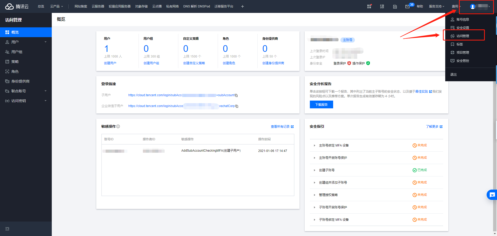
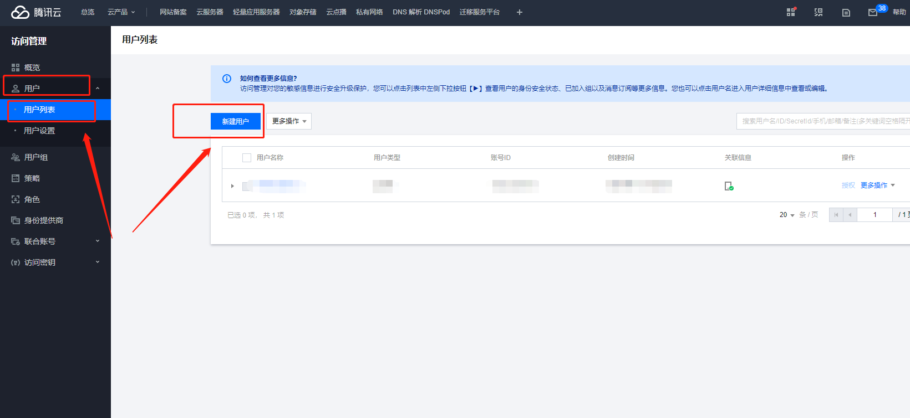
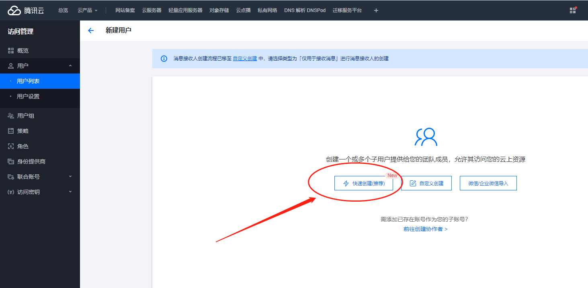
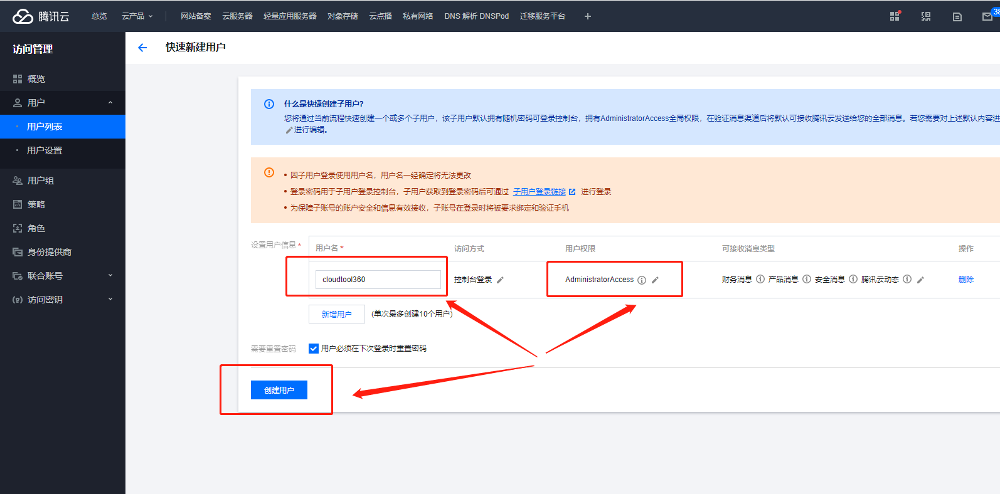
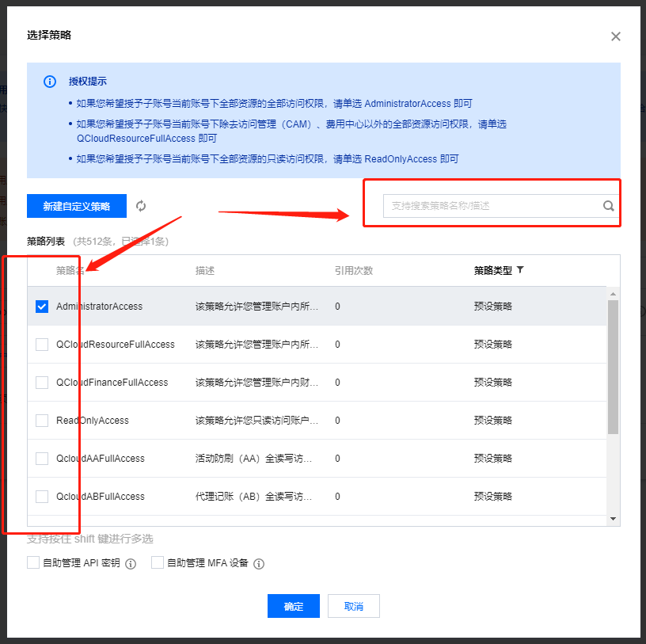
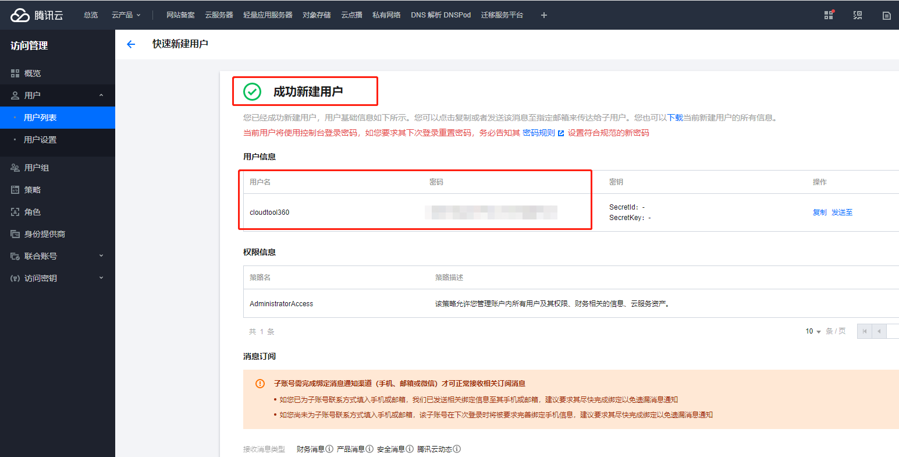
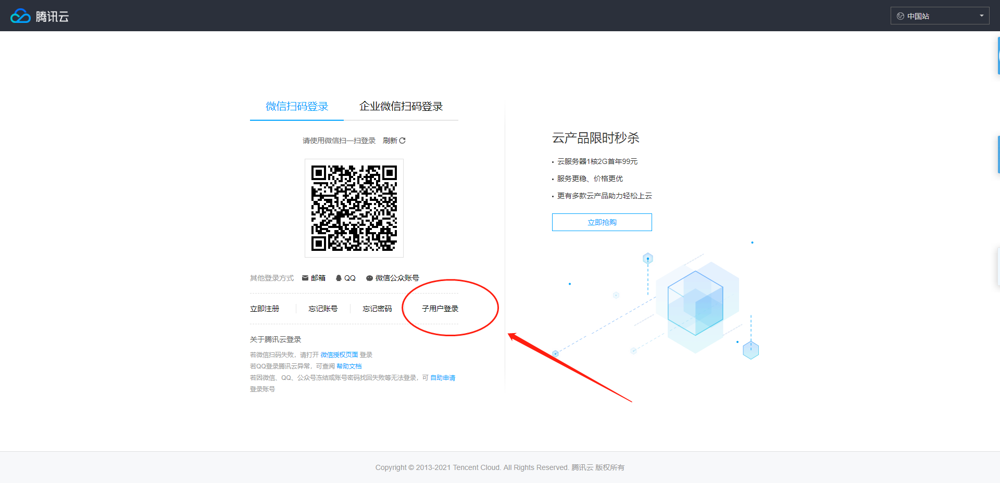
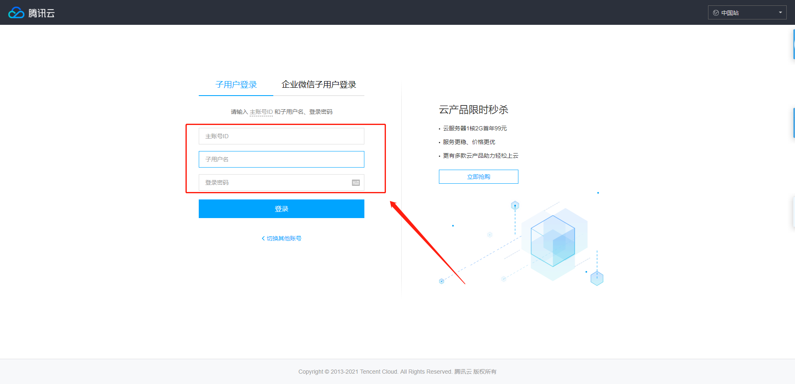

<h1 align="center">子账户</h1>
http://www.cloudtool360.com/jiaocheng/2021/0106/16.html

# 腾讯云怎么添加子账号

##### 1.用 主账号 登录腾讯云控制台 https://www.qcloud.com
将鼠标移动至登录账号处，单击“访问管理”进入访问管理控制台。

##### 2.依次点击“用户” > “新建用户”， 弹出用户类型选择界面。

##### 3.选择快速创建或者自定义创建，我们以推荐的快速创建为例

##### 4.填写好“用户名”，设置好用户权限后，再点>创建用户

用户权限可以通过搜索“相关产品名称”或者“关健词”查找对应的策略，再勾选，点确定

操作完上面这些，就成功的创建好了新的子用户（记录一下用户名和密码就可以去登录了）

##### 5.子用户登录， 浏览器输入 https://www.qcloud.com 点击登录-子用户登录

输入主账号ID，然后输入之前创建的子用户账号和密码

第一次登录需要你修改密码
