### AFTVnews

https://www.aftvnews.com/downloader/

可以在emotion上进行安装，或者其它方式

AFTVnews是一个关于亚马逊Fire TV设备的网站，提供了大量关于Fire TV的新闻、评测、教程等内容

Downloader使Android TV所有者可以轻松地将文件从Internet下载到他们的设备上。您可以输入直接指向文件的URL，也可以旁加载Web浏览器插件以从网站下载文件。浏览器插件支持遥控器和游戏控制器，因此不需要鼠标和键盘。该浏览器插件还可用于全屏模式，缩放和快速访问收藏夹/书签的常规网络冲浪。收藏夹使您可以轻松保存和打开经常访问的URL。下载文件后，您可以使用该应用程序的基本文件管理器打开它们，如果它们是APK应用程序则将其安装或删除。

使用教程 https://streamtelly.com/zh-CN/install-app-fire-tv-stick/

# 如何使用下载器在Fire TV Stick上安装应用程序

要在Fire Stick TV上手动安装任何应用程序（在Amazon商店之外），您首先需要安装一个Downloader应用程序。 为此，请按照以下说明进行操作：

### 将Downloader App安装到Fire TV Stick中

从Fire Stick TV转到菜单，然后选择 **个人设置**.

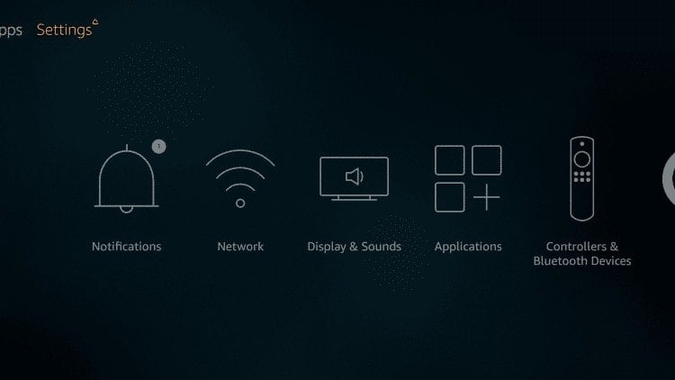

选择 **我的消防电视**

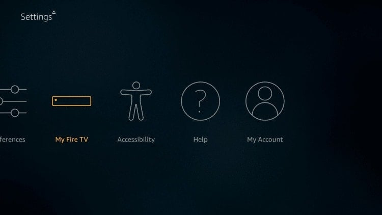

**开发人员选项**

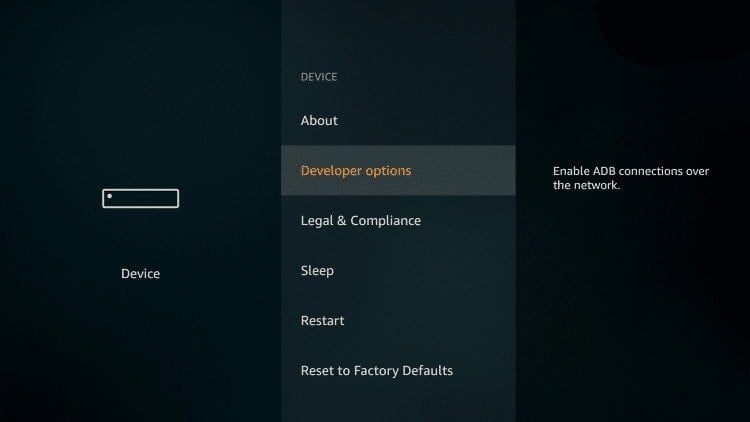

选择 **来自未知来源的应用**

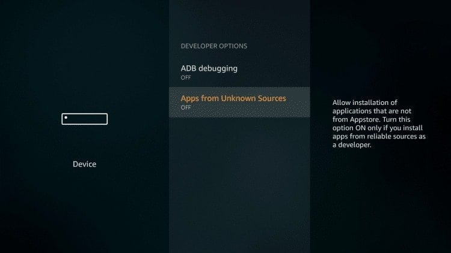

选择 **打开**

请注意，不需要安装未知来源的应用程序即可安装Downloader应用程序。

但是，要安装任何第三方应用程序（APK），需要启用此选项。

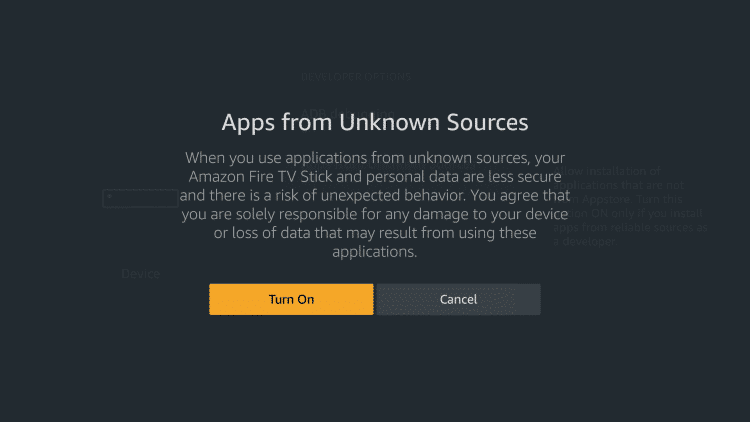

现在， **退货** 转到主屏幕，然后将鼠标悬停在 **搜索** 图标

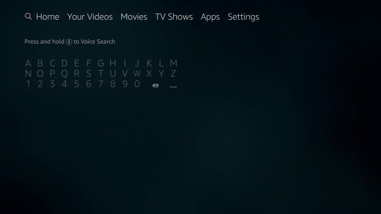

输入 **下载**

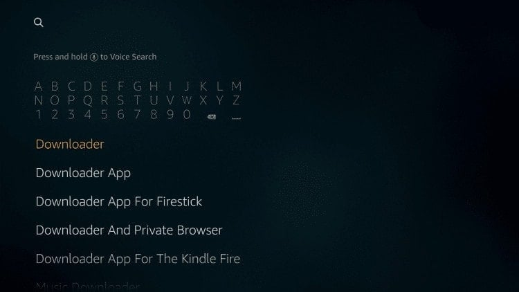

点击 **下载器应用**

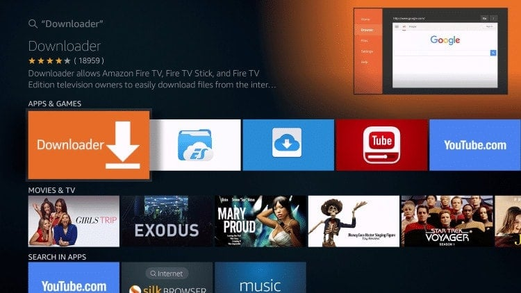

选择上 **下载**

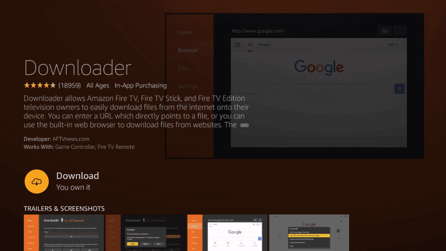

选择 **可选**

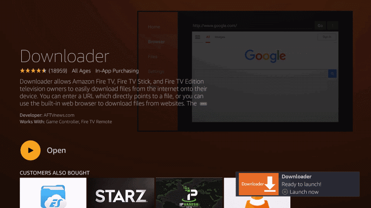

 **让** 当您看到权限警告时

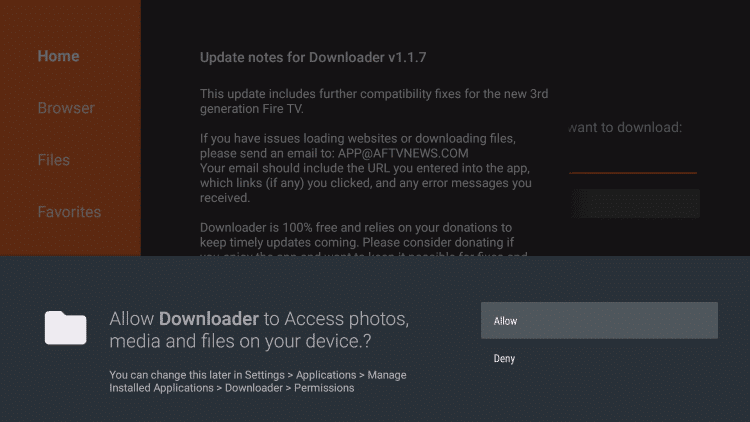

当您看到《快速入门指南》时，请选择 **OK**

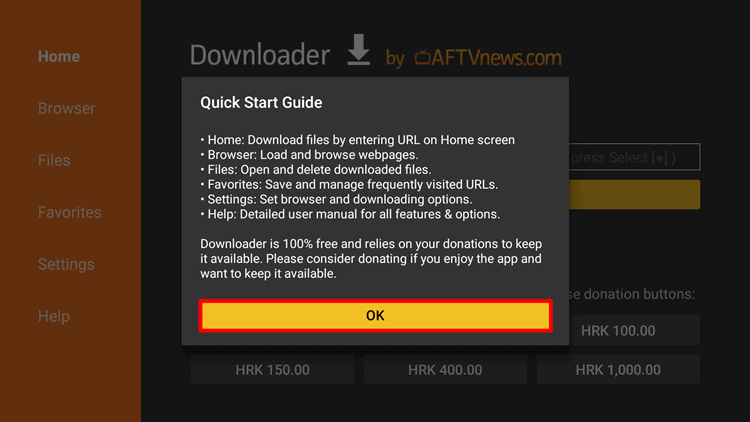

### 使用Downloader App将应用程序下载到Fire TV Stick中

就是这样！ 您现在可以将任何第三方应用程序下载到Fire Stick TV中。

您需要做的就是输入 [网址](https://en.wikipedia.org/wiki/URL) （链接）APK文件，然后单击 **Go**.

**请注意：** 如果您不知道如何查找应用程序URL（链接），请在下面进一步阅读。

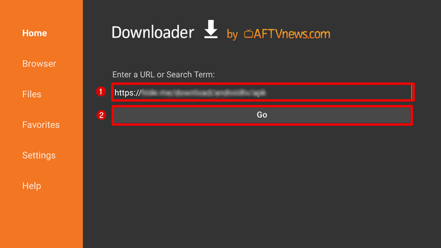

然后它将下载APK文件

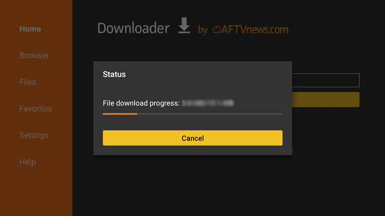

下载完成后，您就可以 **Install 安装** APK文件并在您的Fire TV Stick上使用它。

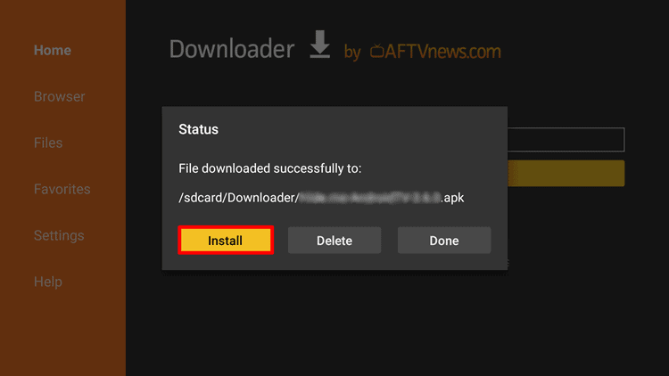

## 如何从Google Play商店将APK文件下载到Fire TV Stick中？

在MyCAD中点击 软件更新 [google.com](https://www.google.com/) 然后在搜索引擎中输入 **[应用名称] Play商店**.

在这个例子中，我要下载 BBC 我的 Fire TV Stick 设备上的 iPlayer 应用程序，我会输入 **BBC iPlayer 游戏商店** 并回车。

当您看到搜索结果时，查找链接 **play.google.com>商店>应用** 然后点击它。

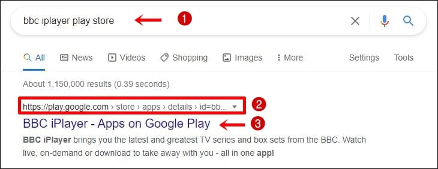

现在，从地址栏中复制应用程序链接。

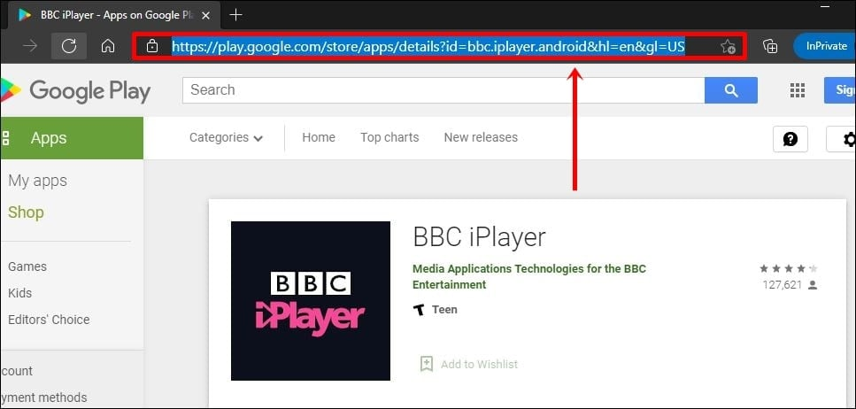

接下来，前往 [APK下载器网站](https://apps.evozi.com/apk-downloader/) 并将您之前复制的链接粘贴到白框中，然后单击 **生成下载链接**.

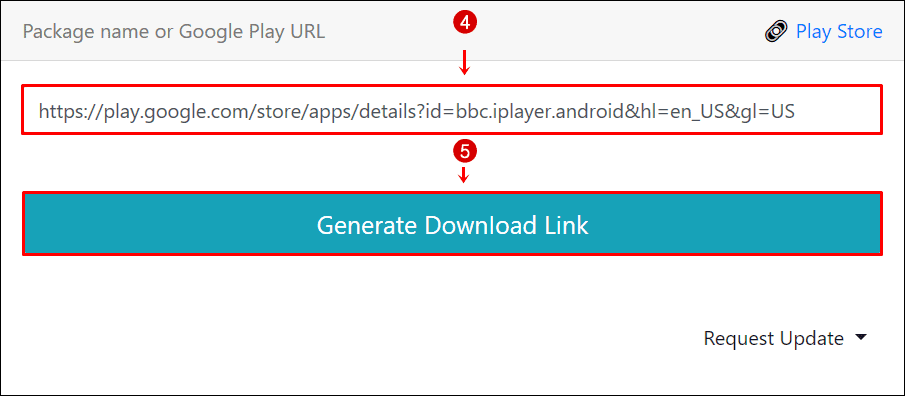

现在，右键单击 **点击这里下载XXXX**（应用名称），然后选择 **复制链接地址。**

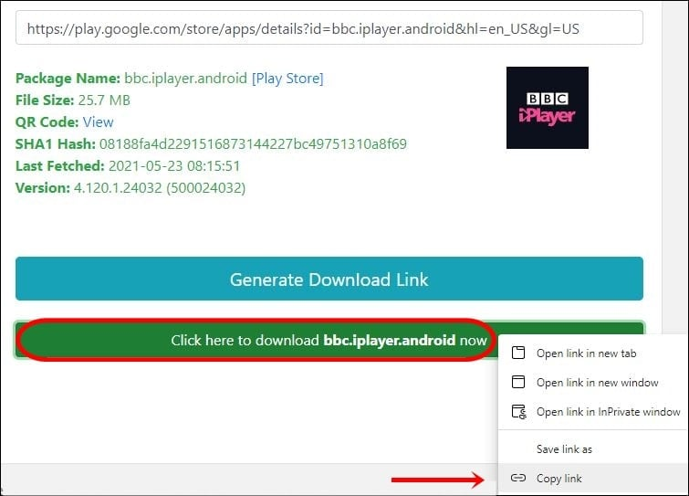

然后，您可以将其粘贴到记事本中，以便按照以下示例查看APK文件链接。

*https://storage.evozi.com/apk/dl/16/10/03/bbc.iplayer.android_xxxxxxx.apk*

最后，在“下载器”应用程序中键入链接，以便可以将应用程序下载到Fire TV Stick中。