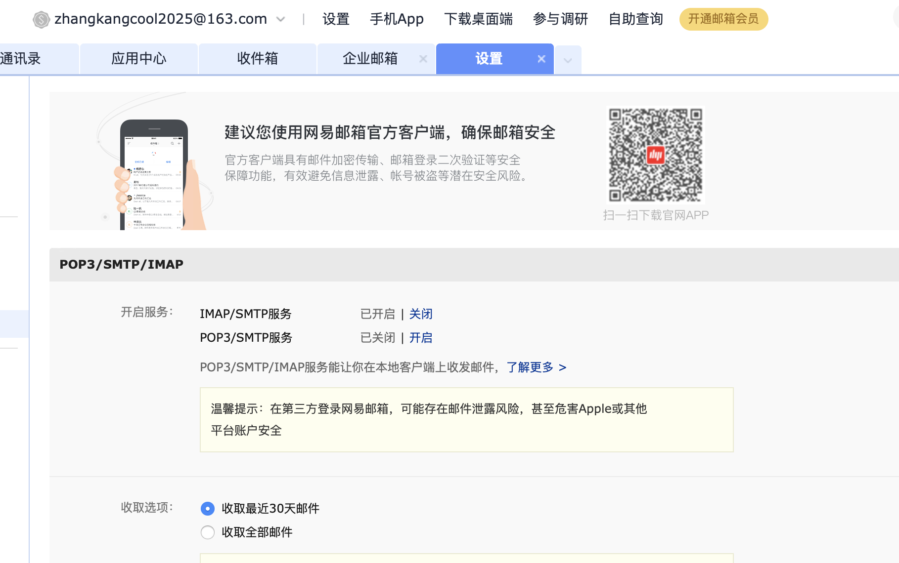

https://www.cnblogs.com/xk-bench/p/16459505.html

当你想要添加QQ邮箱到苹果的邮箱时，会出现这样的报错：

 

iphone添加QQ邮箱的时候，出现以下情况的时候咋搞呢：IMAP服务器不支持密码鉴定；

现在就从头开始教你如何添加QQ邮箱到苹果自带的邮箱软件：

第一步 打开手机的设置

 

 

第二步： 找到邮件图标

 

 

 

第三步： 找到账户

 

 

 

第四步： 添加账户

 

 

 

 

 

在这里不要输入自己的QQ密码，要输入QQ邮箱的授权码：

错误示范：

 

正确操作：先打开qq邮箱，然后点击自己的头像

 

 

点击设置

 

 

 

**选择常规里面的第三方服务，选择开启IMAP/SMTP服务，会生成一串授权码，复制授权码，作为密码输入到手机邮箱里的密码。就添加成功了**

 

 

 

 

 

 

 

 

 

 

 

就成功了！！！

 

https://jingyan.baidu.com/article/c843ea0b97101f36921e4a3e.html

### 163mail

设置中开启IMAP//SMAP

