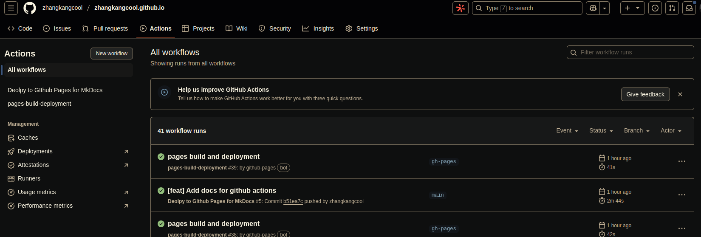

<h1 align="center">github action自动发布</h1>


这里假设仓库已经创建好，并且根据[mkdocs github部署](./mkdocs github部署.md)中的内容已经设置好了分支。

## 1. 新建立YAML文件

```shell
$ tree .github   # 没有.github则新建
.github
└── workflows
    └── ci.yml
```

此步，可以在`github -> Actions -> New workflow`选项下操作，最好是使用命令行进行。



以下为ci.yml文件中的内容

```yaml
name: Deolpy to GIthub Pages for MkDocs 
on:
  push:
    branches:
      - main # 根据实际的分支情况设置，触发该Actions的条件
permissions:
  contents: write
jobs:
  deploy:
    runs-on: ubuntu-latest 
    steps:
      - uses: actions/checkout@v3
      - uses: actions/setup-python@v4
        with:
          python-version: 3.x
      - run: echo "cache_id=$(date --utc '+%V')" >> $GITHUB_ENV 
      - uses: actions/cache@v3
        with:
          key: mkdocs-material-${{ env.cache_id }}
          path: .cache
          restore-keys: |
            mkdocs-material-
      - run: pip install markdown-checklist   # 根据自己requirements.txt进行安装
      - run: pip install mkdocs
      - run: pip install mkdocs-material
      - run: pip install mkdocs-macros-plugin
      - run: pip install mkdocs-minify-plugin
      - run: pip install mkdocs-git-revision-date-localized-plugin
      - run: pip install mkdocs-awesome-pages-plugin
      - run: pip install pymdown-extensions
      - run: pip install mkdocs-git-authors-plugin
      - run: pip install jieba
      - run: mkdocs gh-deploy --force # 部署名林
```


## 2. 提交.github

```shell
git add *
git commit -m "[feat] Add .github"
git push
```


## 3. 打开`github -> Actoins`看部署情况

可以看到每一部命令的详细执行情况，如果报错，根据错误进行代码调整。


### 参考文献

[1] [官方英文文档，包含使用gitlab or github 发布Publishing your site](https://squidfunk.github.io/mkdocs-material/publishing-your-site/)

[2] [GitHub Pages 文档自动化部署](https://blog.arisa.moe/blog/2022/220407-github-pages/)

[3] [Mkdocs+Material+GithubPage+Github Action自动化搭建你自己的博客](https://blog.csdn.net/leoalasiga/article/details/132711171)

