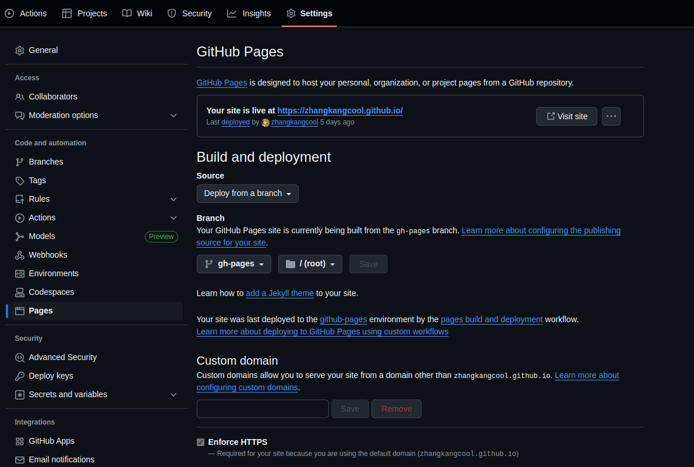

<h1 align="center">mkdocs github部署</h1>


 

在此之前，确保已将代码按照[mkdocs gh-deploy](./mkdocs gh-deploy.md)。中的方法提交到github中。


### 1. pages设置分支

在项目`settings -> Pages中设置分支为gh-pages`，这样在别人输入你的github博客网址时就会访问到`gh-pages`中的内容。




### 2. 设置edit url

```shell
repo_url: https://github.com/zhangkangcool/zhangkangcool.github.io
edit_uri: edit/main/docs/
```

这样在点击`Edit on `之后，会跳转到github上的源代码的编译位置，可以在github上直接对源文件进行修改。