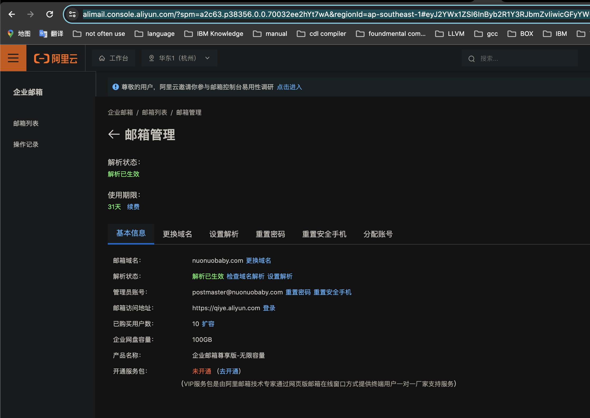
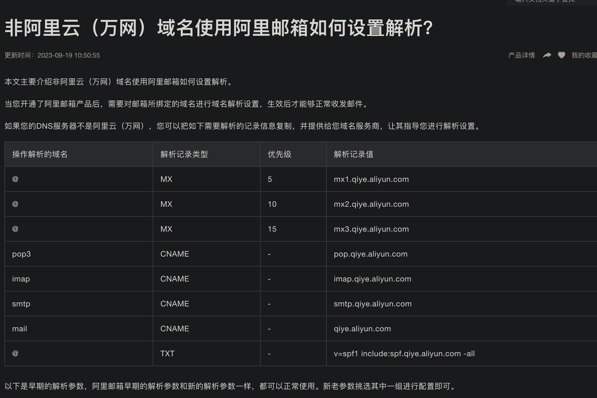
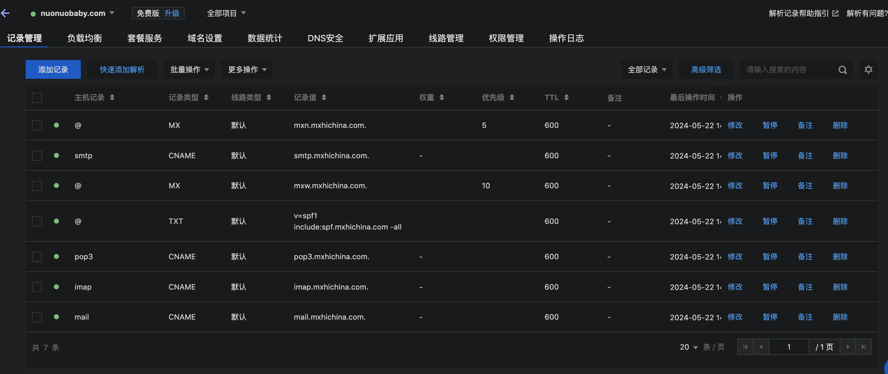

<h1 align="center">mail域名设置</h1>

https://alimail.console.aliyun.com/?spm=a2c63.p38356.0.0.70032ee2hYt7wA&regionId=ap-southeast-1#eyJ2YWx1ZSI6InByb2R1Y3RJbmZvIiwicGFyYW0iOnsiaWQiOiJhbGltYWlsaHplYmRlMmZmOGQ0OTI0NTU2YTQ0MmI0NDk3Nzc4ZGYwMSJ9fQ==

用腾讯域名进行添加的话，以下内容会自动进行添加，但要有添加这个步骤

以下腾讯的截图 

